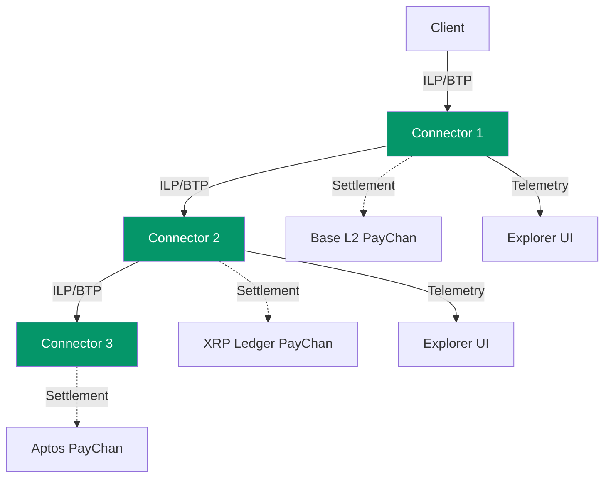

# ILP Connector

[](CHANGELOG.md)
[](https://github.com/yourusername/ilp-connector/actions)
[](https://www.typescriptlang.org/)
[](https://nodejs.org/)
[](LICENSE)

> A TypeScript implementation of an Interledger Protocol (ILP) connector with tri-chain settlement and real-time observability.

---

## TL;DR

**ILP Connector** is a production-ready implementation of the Interledger Protocol that routes payments across different payment networks. It features **tri-chain settlement** (EVM, XRP, Aptos), **TigerBeetle accounting**, and a built-in **Explorer UI** for real-time packet inspection.

### Key Capabilities

- **Multi-Hop Payment Routing** — RFC-compliant ILPv4 with BTP WebSocket protocol
- **Tri-Chain Settlement** — Instant finality on Base L2, XRP Ledger, and Aptos
- **Double-Entry Accounting** — TigerBeetle integration for balance tracking
- **Explorer UI** — Real-time packet inspection, settlement monitoring, and payment channel visualization

---

## Protocol Components

### Interledger Protocol (ILP) & Bilateral Transfer Protocol (BTP)

**ILP** is a protocol suite for routing payments across different payment networks, similar to how IP routes data packets across networks. This implementation uses **ILPv4** with **BTP** for connector-to-connector communication.

#### Key Concepts

- **ILP Packets** — Three types: PREPARE (initiate), FULFILL (confirm), REJECT (fail)
- **Hashed Timelock Agreements (HTLCs)** — Cryptographic escrow ensuring atomic payments
- **Multi-Hop Routing** — Payments route through intermediate connectors without trust
- **Address Format** — Hierarchical addressing (e.g., `g.connector.alice`)

#### Implementation

- **RFC-0027** ILPv4 packet format and routing logic
- **RFC-0023** BTP WebSocket protocol for connector peering
- **RFC-0030** OER (Octet Encoding Rules) for binary serialization

#### Official Documentation

- [Interledger.org](https://interledger.org) — Official protocol website
- [RFC Index](https://interledger.org/rfcs/) — Complete specification library
- [RFC-0027: ILPv4](https://interledger.org/rfcs/0027-interledger-protocol-4/) — Core protocol spec
- [RFC-0023: BTP](https://interledger.org/rfcs/0023-bilateral-transfer-protocol/) — Bilateral transfer protocol
- [Rafiki](https://rafiki.dev) — Production ILP implementation (for comparison)

---

### Payment Channels

**Payment channels** enable instant, low-cost cryptocurrency transfers between two parties by conducting most transactions off-chain and settling net balances on-chain.

#### How Payment Channels Work

1. **Open** — Both parties lock funds in a multi-signature smart contract
2. **Transact** — Exchange signed balance proofs off-chain (instant, free)
3. **Settle** — Submit final balance proof to blockchain (cooperative close)
4. **Dispute** — Challenge invalid proofs with timeout mechanism (non-cooperative close)

#### Tri-Chain Settlement

**1. EVM Payment Channels (Base L2)**

- XRP-style payment channels as Solidity smart contracts
- Deployed on Base L2 (Ethereum Layer 2)
- Sub-cent transaction fees, instant finality

**2. XRP Payment Channels (PayChan)**

- Native XRP Ledger payment channels
- Claim-based settlement with signature verification
- High throughput, low latency

**3. Aptos Move Payment Channels**

- Move smart contract modules on Aptos
- 160,000+ TPS capability, sub-second finality

#### Official Documentation

- [XRP Ledger PayChan](https://xrpl.org/payment-channels.html) — XRP payment channel docs
- [Base L2](https://base.org) — Ethereum Layer 2 network
- [Aptos](https://aptos.dev) — Aptos blockchain documentation

---

## Architecture Overview



### Component Responsibilities

| Component            | Role                             | Protocols                    |
| -------------------- | -------------------------------- | ---------------------------- |
| **ILP Connectors**   | Route packets between peers      | ILPv4, BTP, HTLC escrow      |
| **Payment Channels** | Off-chain settlement layer       | EVM, XRP PayChan, Aptos Move |
| **TigerBeetle**      | Double-entry accounting database | Financial transactions       |
| **Explorer UI**      | Real-time network monitoring     | WebSocket, React, shadcn/ui  |

---

## Monorepo Structure

```
ilp-connector/
├── packages/
│   ├── connector/          # ILP Connector
│   │   ├── src/
│   │   │   ├── core/       # ConnectorNode, PacketHandler
│   │   │   ├── btp/        # BTP Server/Client
│   │   │   ├── routing/    # RoutingTable
│   │   │   ├── settlement/ # Multi-chain settlement
│   │   │   ├── explorer/   # Explorer server
│   │   │   └── telemetry/  # Event emission
│   │   └── explorer-ui/    # React UI with shadcn/ui
│   ├── agent-runtime/      # Agent Runtime (SPSP/STREAM handler)
│   │   └── src/
│   │       ├── spsp/       # SPSP endpoint
│   │       ├── stream/     # STREAM fulfillment crypto
│   │       ├── session/    # Payment session management
│   │       └── business/   # Business logic client
│   └── shared/             # Shared types and utilities
│       └── src/types/      # TypeScript interfaces
├── examples/
│   ├── business-logic-typescript/  # TypeScript boilerplate
│   └── business-logic-example/     # Simple Node.js example
├── scripts/                # Test runners
├── docker/                 # Docker Compose configurations
└── docs/                   # Documentation
    └── prd/                # Product requirement docs (epics)
```

---

## Agent Runtime & Custom Business Logic

The **Agent Runtime** handles ILP/SPSP/STREAM protocol complexity, allowing you to build custom payment handlers without understanding the underlying protocols.

### Architecture

```
┌─────────────┐      ┌─────────────────────┐      ┌───────────────────┐
│  Connector  │      │    Agent Runtime    │      │  Business Logic   │
│             │ HTTP │    (this project)   │ HTTP │  (your code)      │
│  Routes to  │─────►│  - SPSP endpoint    │─────►│  - Accept/reject  │
│  local addr │      │  - Session mgmt     │      │  - Custom rules   │
│             │◄─────│  - STREAM fulfill   │◄─────│  - Your database  │
└─────────────┘      └─────────────────────┘      └───────────────────┘
```

### Quick Start

> **📘 Full Guide:** See [Creating Your Own ILP Agent](docs/guides/creating-your-agent.md) for complete workflow options (separate repo, fork, monorepo).

**You only implement the Business Logic** - the Connector and Agent Runtime are provided as pre-built components.

#### 1. Create Your Business Logic Server

Your server needs to implement two endpoints:

| Endpoint          | Method | Purpose                                     |
| ----------------- | ------ | ------------------------------------------- |
| `/handle-payment` | POST   | **Required.** Process incoming ILP payments |
| `/payment-setup`  | POST   | _Optional._ Customize SPSP setup            |
| `/health`         | GET    | _Recommended._ Health check                 |

#### 2. Use the TypeScript Boilerplate

```bash
# Copy the boilerplate
cp -r examples/business-logic-typescript my-payment-handler
cd my-payment-handler

# Install dependencies
npm install

# Run in development
npm run dev

# Or build and run
npm run build
npm start
```

#### 3. Implement Your Logic

Edit `src/server.ts` and implement the `handlePayment` function:

```typescript
async function handlePayment(request: PaymentRequest): Promise<PaymentResponse> {
  const { paymentId, amount, destination, data, expiresAt, metadata } = request;

  // Your business logic here:
  // - Check inventory
  // - Validate user
  // - Record payment
  // - Decode and process STREAM data
  // - etc.

  // Optional: Decode the STREAM data if present
  if (data) {
    const streamData = Buffer.from(data, 'base64');
    // Process STREAM protocol data (invoices, receipts, etc.)
  }

  // Accept the payment
  return { accept: true };

  // Or reject with reason
  return {
    accept: false,
    rejectReason: {
      code: 'insufficient_funds',
      message: 'Account balance too low',
    },
  };
}
```

### API Reference

#### POST /handle-payment

Called for each incoming ILP payment packet.

**Request:**

```json
{
  "paymentId": "abc123",
  "destination": "g.connector.agent.abc123",
  "amount": "1000000",
  "expiresAt": "2024-01-15T12:00:00.000Z",
  "data": "base64-encoded-stream-data",
  "metadata": {
    "productId": "prod-456",
    "userId": "user-789"
  }
}
```

**Response (Accept):**

```json
{
  "accept": true,
  "data": "base64-encoded-response-data"
}
```

**Response (Reject):**

```json
{
  "accept": false,
  "rejectReason": {
    "code": "invalid_amount",
    "message": "Amount exceeds maximum allowed"
  }
}
```

**Reject Codes:**

| Code                 | ILP Error | Description                |
| -------------------- | --------- | -------------------------- |
| `insufficient_funds` | T04       | Account balance too low    |
| `expired`            | R00       | Payment expired            |
| `invalid_request`    | F00       | Bad request format         |
| `invalid_amount`     | F03       | Amount out of range        |
| `unexpected_payment` | F06       | Not expecting this payment |
| `application_error`  | F99       | Generic application error  |
| `internal_error`     | T00       | Temporary internal error   |

#### POST /payment-setup (Optional)

Called when SPSP endpoint is queried (before payment begins).

**Request:**

```json
{
  "paymentId": "custom-id",
  "queryParams": {
    "product": "premium-plan",
    "user": "user-123"
  }
}
```

**Response:**

```json
{
  "allow": true,
  "metadata": {
    "productId": "premium-plan",
    "userId": "user-123"
  },
  "paymentId": "custom-payment-id"
}
```

### Deploy with Docker Compose

```yaml
# docker-compose.yml (in your project root or separate repo)
services:
  connector:
    image: ilp-connector
    environment:
      LOCAL_DELIVERY_ENABLED: 'true'
      LOCAL_DELIVERY_URL: http://agent-runtime:3100
    depends_on:
      - agent-runtime

  agent-runtime:
    image: agent-runtime
    environment:
      BASE_ADDRESS: g.connector.agent
      BUSINESS_LOGIC_URL: http://business-logic:8080
    depends_on:
      - business-logic

  business-logic:
    # Path to YOUR business logic directory (relative to docker-compose.yml)
    # Options:
    #   build: .                    (if docker-compose.yml is in your business logic dir)
    #   build: ./my-payment-handler (if in a subdirectory)
    #   build: ./business-logic     (if you forked m2m and added business-logic/ folder)
    build: ./my-payment-handler
    ports:
      - '8080:8080'
```

```bash
# Option 1: If using pre-built images from this repo
docker build -t ilp-connector .
docker build -t agent-runtime -f packages/agent-runtime/Dockerfile .
docker-compose up -d

# Option 2: If images are published (future)
# docker-compose up -d (will pull images automatically)
```

**📘 See [Creating Your Own ILP Agent](docs/guides/creating-your-agent.md) for detailed workflow examples.**

### Deploy with Kubernetes

```bash
# Deploy agent runtime
kubectl apply -k k8s/agent-runtime

# Deploy your business logic
kubectl apply -f my-business-logic-deployment.yaml

# Configure connector to use agent runtime
kubectl -n m2m-connector set env deployment/connector \
  LOCAL_DELIVERY_ENABLED=true \
  LOCAL_DELIVERY_URL=http://agent-runtime.m2m-agent-runtime.svc.cluster.local:3100
```

### Environment Variables

#### Agent Runtime

| Variable                 | Description                                    | Default    |
| ------------------------ | ---------------------------------------------- | ---------- |
| `PORT`                   | HTTP server port                               | `3100`     |
| `BASE_ADDRESS`           | ILP address prefix (e.g., `g.connector.agent`) | _Required_ |
| `BUSINESS_LOGIC_URL`     | URL to your business logic server              | _Required_ |
| `BUSINESS_LOGIC_TIMEOUT` | Request timeout (ms)                           | `5000`     |
| `SPSP_ENABLED`           | Enable SPSP endpoint                           | `true`     |
| `SESSION_TTL_MS`         | Payment session TTL (ms)                       | `3600000`  |
| `LOG_LEVEL`              | Logging level                                  | `info`     |

#### Connector (Local Delivery)

| Variable                 | Description                        | Default |
| ------------------------ | ---------------------------------- | ------- |
| `LOCAL_DELIVERY_ENABLED` | Enable forwarding to agent runtime | `false` |
| `LOCAL_DELIVERY_URL`     | Agent runtime URL                  | —       |
| `LOCAL_DELIVERY_TIMEOUT` | Request timeout (ms)               | `30000` |

### Example Use Cases

**E-Commerce:**

```typescript
async function handlePayment(req: PaymentRequest) {
  const { productId } = req.metadata || {};

  // Check inventory
  const product = await db.products.findById(productId);
  if (!product || product.stock <= 0) {
    return { accept: false, rejectReason: { code: 'invalid_request', message: 'Out of stock' } };
  }

  // Reserve item and accept payment
  await db.products.decrementStock(productId);
  await db.orders.create({ paymentId: req.paymentId, productId, amount: req.amount });

  return { accept: true };
}
```

**API Monetization:**

```typescript
async function handlePayment(req: PaymentRequest) {
  const { apiKey } = req.metadata || {};

  // Validate API key
  const user = await db.users.findByApiKey(apiKey);
  if (!user) {
    return { accept: false, rejectReason: { code: 'invalid_request', message: 'Invalid API key' } };
  }

  // Credit the user's balance
  await db.users.creditBalance(user.id, BigInt(req.amount));

  return { accept: true };
}
```

**Streaming Payments:**

```typescript
// Accept streaming micropayments
async function handlePayment(req: PaymentRequest) {
  const amount = BigInt(req.amount);

  // Track cumulative payment
  const session = sessions.get(req.paymentId) || { total: 0n };
  session.total += amount;
  sessions.set(req.paymentId, session);

  console.log(`Payment ${req.paymentId}: received ${amount}, total ${session.total}`);

  // Always accept streaming chunks
  return { accept: true };
}
```

---

## Prerequisites

- **Docker** (v27.0.0+)
  - **Linux/Windows:** Docker Desktop or Docker Engine
  - **macOS:** [OrbStack](https://orbstack.dev/) (recommended) or Docker Desktop
- **Node.js** (v22.11.0 LTS)
- **npm** (v10.9.0+)
- **8GB RAM** minimum (16GB recommended)
- **10GB disk space** for Docker images

### macOS Development Setup

**⚠️ Important for macOS developers:** TigerBeetle (our accounting database) requires native installation on macOS. Docker Desktop and OrbStack both have compatibility issues with TigerBeetle's `io_uring` requirements.

**✅ Recommended Solution:** Install TigerBeetle natively (no Docker needed for the database).

**Quick Setup (5 minutes):**

```bash
# 1. Install TigerBeetle binary
npm run tigerbeetle:install

# 2. Start development (TigerBeetle + Connector)
npm run dev
```

**Why Native Installation?**

- ✅ Perfect dev/production parity (same TigerBeetle binary)
- ✅ Zero Docker compatibility issues
- ✅ Simple one-command setup
- ✅ Works on both Apple Silicon (M1/M2/M3) and Intel Macs
- ✅ Production uses containerized TigerBeetle (same binary, different deployment)

**What Gets Installed:**

- TigerBeetle binary → `/usr/local/bin/tigerbeetle`
- Data directory → `~/.tigerbeetle/data`
- Auto-starts with `npm run dev`

**📚 Full Guide:** [macOS Development Setup](docs/guides/local-development-macos.md)

### Port Requirements

| Port      | Service                   |
| --------- | ------------------------- |
| 8201-8203 | Connector APIs            |
| 9200-9203 | Explorer UIs              |
| 8545      | Anvil (local EVM testnet) |

---

## Installation

### 1. Clone Repository

```bash
git clone https://github.com/yourusername/ilp-connector.git
cd ilp-connector
```

### 2. Install Dependencies

```bash
# Install all workspace dependencies
npm install

# Build TypeScript packages
npm run build
```

### 3. Run Tests

```bash
# Run unit tests
npm test

# Run integration tests
npm run test:integration
```

---

## Deployment Guide

This section covers deploying the ILP Connector with Docker Compose and Kubernetes, including configuration for secrets and custom tokens.

### Quick Reference

| Environment        | Command             | Secrets     | Token Config     |
| ------------------ | ------------------- | ----------- | ---------------- |
| **Local Dev**      | `npm run dev`       | `.env` file | Local Anvil      |
| **Docker Compose** | `docker-compose up` | `.env` file | Testnet/Mainnet  |
| **Kubernetes**     | `kubectl apply -k`  | K8s Secrets | ConfigMap/Secret |

---

### Docker Compose Deployment

#### 1. Prepare Environment File

```bash
# Copy the example configuration
cp .env.example .env

# Edit with your values
nano .env
```

#### 2. Configure Secrets

**Development (local testing):**

```env
# Key management - env backend for development only
KEY_BACKEND=env

# EVM private key (hex format)
EVM_PRIVATE_KEY=0xac0974bec39a17e36ba4a6b4d238ff944bacb478cbed5efcae784d7bf4f2ff80

# XRP seed (optional, for XRP settlement)
XRP_SEED=sEdTM1JVyAnDtG7pKF4AeTJrWLWr9oF

# Aptos private key (optional, for Aptos settlement)
APTOS_PRIVATE_KEY=0x...
```

**Production (KMS required):**

```env
# AWS KMS
KEY_BACKEND=aws-kms
AWS_REGION=us-east-1
AWS_KMS_EVM_KEY_ID=arn:aws:kms:us-east-1:123456789012:key/xxxxx

# GCP KMS
KEY_BACKEND=gcp-kms
GCP_PROJECT_ID=my-project
GCP_LOCATION_ID=us-east1
GCP_KEY_RING_ID=connector-keyring
GCP_KMS_EVM_KEY_ID=evm-signing-key

# Azure Key Vault
KEY_BACKEND=azure-keyvault
AZURE_VAULT_URL=https://my-vault.vault.azure.net
AZURE_EVM_KEY_NAME=evm-signing-key
```

#### 3. Configure Blockchain Networks

Use `NETWORK_MODE` to quickly switch between testnet and mainnet for all chains:

```env
# Set network mode: 'testnet' (default) or 'mainnet'
NETWORK_MODE=testnet
```

**Network Mode URL Mappings:**

| Chain   | Testnet                                     | Mainnet                                     |
| ------- | ------------------------------------------- | ------------------------------------------- |
| Base L2 | `https://sepolia.base.org`                  | `https://mainnet.base.org`                  |
| XRP     | `wss://s.altnet.rippletest.net:51233`       | `wss://xrplcluster.com`                     |
| Aptos   | `https://fullnode.testnet.aptoslabs.com/v1` | `https://fullnode.mainnet.aptoslabs.com/v1` |

**Using the deploy script (recommended):**

```bash
# Testnet deployment (default)
./scripts/deploy-5-peer-multihop.sh

# Mainnet deployment
NETWORK_MODE=mainnet ./scripts/deploy-5-peer-multihop.sh
```

**Using docker-compose directly:**

```bash
# Source the network mode helper first
source scripts/set-network-mode.sh

# Or for mainnet
NETWORK_MODE=mainnet source scripts/set-network-mode.sh

# Then run docker-compose
docker-compose -f docker-compose-5-peer-multihop.yml up -d
```

**Override individual URLs** (optional):

```env
# Override specific URLs while using NETWORK_MODE for others
NETWORK_MODE=mainnet
BASE_L2_RPC_URL=https://base-mainnet.g.alchemy.com/v2/YOUR_API_KEY  # Custom RPC
# XRPL_WSS_URL and APTOS_NODE_URL will use mainnet defaults
```

#### 4. Configure Custom Token (Base/EVM)

To use your own ERC-20 token instead of the default M2M token:

```env
# Your custom ERC-20 token contract address
M2M_TOKEN_ADDRESS=0xYourTokenContractAddress

# Token Network Registry (Raiden-style payment channels)
# Deploy your own or use existing registry
TOKEN_NETWORK_REGISTRY=0xYourRegistryContractAddress

# Settlement configuration
SETTLEMENT_ENABLED=true
SETTLEMENT_THRESHOLD=1000000  # In token base units (e.g., 1 token with 6 decimals)
```

**Deploying Custom Contracts:**

```bash
# Navigate to contracts package
cd packages/contracts

# Deploy M2M token (or use existing ERC-20)
npx hardhat run scripts/deploy-token.ts --network base-sepolia

# Deploy Token Network Registry
npx hardhat run scripts/deploy-registry.ts --network base-sepolia

# Copy addresses to .env
```

#### 5. Configure Custom Token (Aptos)

For Aptos settlement with a custom Move token:

```env
# Aptos module address (where your payment channel module is deployed)
APTOS_MODULE_ADDRESS=0xYourModuleAddress

# Your Aptos account address
APTOS_ADDRESS=0xYourAptosAddress

# Aptos private key
APTOS_PRIVATE_KEY=0xYourPrivateKey
```

#### 6. Start Services

```bash
# Single connector
docker-compose up -d

# 5-peer multi-hop network
docker-compose -f docker-compose-5-peer-multihop.yml up -d --build

# View logs
docker-compose logs -f
```

#### 7. Verify Deployment

```bash
# Check health endpoints
curl http://localhost:9080/health  # Peer 1
curl http://localhost:9081/health  # Peer 2

# Access Explorer UI
open http://localhost:5173  # Peer 1 Explorer
```

---

### Kubernetes Deployment

#### 1. Prerequisites

- Kubernetes cluster (1.25+)
- kubectl configured
- kustomize (built into kubectl)

#### 2. Deploy TigerBeetle

```bash
# Create namespace and deploy TigerBeetle
kubectl apply -k k8s/tigerbeetle/base

# Verify TigerBeetle is running
kubectl -n tigerbeetle get pods
```

#### 3. Create Secrets

**Option A: Direct kubectl (development):**

```bash
kubectl -n m2m-connector create secret generic connector-secrets \
  --from-literal=EVM_PRIVATE_KEY=0xYourPrivateKey \
  --from-literal=XRP_SEED=sYourXRPSeed \
  --from-literal=APTOS_PRIVATE_KEY=0xYourAptosKey \
  --from-literal=M2M_TOKEN_ADDRESS=0xYourTokenAddress \
  --from-literal=TOKEN_NETWORK_REGISTRY=0xYourRegistryAddress
```

**Option B: Sealed Secrets (production):**

```bash
# Install Sealed Secrets controller
kubectl apply -f https://github.com/bitnami-labs/sealed-secrets/releases/download/v0.24.0/controller.yaml

# Create sealed secret
kubeseal --format=yaml < k8s/connector/base/secret.yaml > sealed-secret.yaml
kubectl apply -f sealed-secret.yaml
```

**Option C: External Secrets Operator (production):**

```yaml
# external-secret.yaml
apiVersion: external-secrets.io/v1beta1
kind: ExternalSecret
metadata:
  name: connector-secrets
  namespace: m2m-connector
spec:
  refreshInterval: 1h
  secretStoreRef:
    name: aws-secrets-manager
    kind: ClusterSecretStore
  target:
    name: connector-secrets
  data:
    - secretKey: EVM_PRIVATE_KEY
      remoteRef:
        key: m2m/connector/evm-key
    - secretKey: M2M_TOKEN_ADDRESS
      remoteRef:
        key: m2m/connector/token-address
```

#### 4. Configure Blockchain Networks (Testnet vs Mainnet)

Kubernetes uses **overlays** to switch between testnet and mainnet. Choose the appropriate overlay:

| Overlay      | Network Mode | Base    | XRP     | Aptos   |
| ------------ | ------------ | ------- | ------- | ------- |
| `staging`    | **Testnet**  | Sepolia | Testnet | Testnet |
| `production` | **Mainnet**  | Mainnet | Mainnet | Mainnet |

**Testnet Deployment:**

```bash
kubectl apply -k k8s/connector/overlays/staging
```

Configures:

- `NETWORK_MODE: testnet`
- `BASE_L2_RPC_URL: https://sepolia.base.org`
- `XRPL_WSS_URL: wss://s.altnet.rippletest.net:51233`
- `APTOS_NODE_URL: https://fullnode.testnet.aptoslabs.com/v1`

**Mainnet Deployment:**

```bash
kubectl apply -k k8s/connector/overlays/production
```

Configures:

- `NETWORK_MODE: mainnet`
- `BASE_L2_RPC_URL: https://mainnet.base.org`
- `XRPL_WSS_URL: wss://xrplcluster.com`
- `APTOS_NODE_URL: https://fullnode.mainnet.aptoslabs.com/v1`

#### 5. Custom Token Configuration

**Via ConfigMap patch:**

```yaml
# k8s/connector/overlays/custom/kustomization.yaml
apiVersion: kustomize.config.k8s.io/v1beta1
kind: Kustomization

namespace: m2m-connector

resources:
  - ../../base

patches:
  - patch: |
      apiVersion: v1
      kind: ConfigMap
      metadata:
        name: connector-config
      data:
        # Custom blockchain RPC
        BASE_L2_RPC_URL: "https://your-rpc-endpoint.com"
        # Settlement settings
        SETTLEMENT_ENABLED: "true"
        SETTLEMENT_THRESHOLD: "5000000"
    target:
      kind: ConfigMap
      name: connector-config
```

**Via Secret for token addresses:**

```bash
kubectl -n m2m-connector create secret generic connector-secrets \
  --from-literal=M2M_TOKEN_ADDRESS=0xYourCustomToken \
  --from-literal=TOKEN_NETWORK_REGISTRY=0xYourCustomRegistry \
  --dry-run=client -o yaml | kubectl apply -f -
```

#### 6. Deploy Connector

```bash
# Staging deployment
kubectl apply -k k8s/connector/overlays/staging

# Production deployment
kubectl apply -k k8s/connector/overlays/production

# Verify deployment
kubectl -n m2m-connector get pods
kubectl -n m2m-connector logs -f deployment/connector
```

#### 7. Expose Services

```bash
# Port-forward for local access
kubectl -n m2m-connector port-forward svc/connector 4000:4000  # BTP
kubectl -n m2m-connector port-forward svc/connector 5173:5173  # Explorer

# Or create Ingress for external access
kubectl apply -f - <<EOF
apiVersion: networking.k8s.io/v1
kind: Ingress
metadata:
  name: connector-ingress
  namespace: m2m-connector
spec:
  rules:
    - host: connector.example.com
      http:
        paths:
          - path: /
            pathType: Prefix
            backend:
              service:
                name: connector
                port:
                  number: 4000
EOF
```

---

### Environment Variables Reference

#### Core Settings

| Variable                | Description                           | Default         |
| ----------------------- | ------------------------------------- | --------------- |
| `NODE_ID`               | Unique connector identifier           | `m2m-connector` |
| `LOG_LEVEL`             | Logging level (debug/info/warn/error) | `info`          |
| `SETTLEMENT_PREFERENCE` | Settlement chain (evm/xrp/aptos/both) | `evm`           |
| `NETWORK_MODE`          | Network selection (testnet/mainnet)   | `testnet`       |

#### Blockchain Networks

URLs are auto-configured based on `NETWORK_MODE`. Override individually if needed:

| Variable          | Description          | Testnet Default                             | Mainnet Default                             |
| ----------------- | -------------------- | ------------------------------------------- | ------------------------------------------- |
| `BASE_L2_RPC_URL` | Base L2 RPC endpoint | `https://sepolia.base.org`                  | `https://mainnet.base.org`                  |
| `XRPL_WSS_URL`    | XRP Ledger WebSocket | `wss://s.altnet.rippletest.net:51233`       | `wss://xrplcluster.com`                     |
| `APTOS_NODE_URL`  | Aptos fullnode URL   | `https://fullnode.testnet.aptoslabs.com/v1` | `https://fullnode.mainnet.aptoslabs.com/v1` |

#### Token & Contract Addresses

| Variable                 | Description               | Required For     |
| ------------------------ | ------------------------- | ---------------- |
| `M2M_TOKEN_ADDRESS`      | ERC-20 token contract     | EVM settlement   |
| `TOKEN_NETWORK_REGISTRY` | Payment channel registry  | EVM settlement   |
| `APTOS_MODULE_ADDRESS`   | Aptos Move module address | Aptos settlement |

#### Key Management

| Variable            | Description                     | Values                                        |
| ------------------- | ------------------------------- | --------------------------------------------- |
| `KEY_BACKEND`       | Secret storage backend          | `env`, `aws-kms`, `gcp-kms`, `azure-keyvault` |
| `EVM_PRIVATE_KEY`   | EVM signing key (env backend)   | `0x...`                                       |
| `XRP_SEED`          | XRP seed (env backend)          | `s...`                                        |
| `APTOS_PRIVATE_KEY` | Aptos signing key (env backend) | `0x...`                                       |

#### Settlement

| Variable               | Description                      | Default   |
| ---------------------- | -------------------------------- | --------- |
| `SETTLEMENT_ENABLED`   | Enable automatic settlement      | `true`    |
| `SETTLEMENT_THRESHOLD` | Balance threshold for settlement | `1000000` |

---

### Production Checklist

Before deploying to production:

- [ ] `KEY_BACKEND` is NOT `env` (use KMS)
- [ ] `GRAFANA_PASSWORD` changed from default
- [ ] Using HTTPS RPC endpoints
- [ ] Secrets managed via KMS/Vault
- [ ] TigerBeetle has 3+ replicas
- [ ] Network policies configured
- [ ] Resource limits set appropriately
- [ ] Monitoring/alerting configured

Run the preflight validation:

```bash
./scripts/production-preflight.sh
```

---

## Project Status

See [Epic List](docs/prd/epic-list.md) for the complete list of features.

### Completed Features

- **Epics 1-2, 4-5, 10** — Core ILP implementation, BTP protocol, CI/CD
- **Epics 6-9, 27-28** — Settlement infrastructure (TigerBeetle, EVM, XRP, Aptos)
- **Epics 3, 14-15, 29** — Explorer UI with real-time observability

All 15 epics are **completed**. The connector is feature-complete.

---

## Documentation

### Core Documentation

- [Epic List](docs/prd/epic-list.md) — Complete feature list

### Technical Documentation

- [ILP Packet Routing](docs/architecture/core-workflows.md)
- [Components](docs/architecture/components.md)
- [Settlement Engines](docs/architecture/external-apis.md)

### Development

- [Contributing Guidelines](CONTRIBUTING.md)
- [Testing Guide](docs/architecture/test-strategy-and-standards.md)

---

## Technology Stack

### Runtime & Languages

- **TypeScript 5.3.3** — Type-safe development
- **Node.js 22.11.0 LTS** — Runtime environment
- **Docker & Docker Compose** — Containerization and orchestration

### Core Dependencies

- **tigerbeetle-node** — Double-entry accounting
- **ws** — WebSocket (BTP protocol)
- **pino** — Structured logging

### Blockchain SDKs

- **viem** — EVM interaction (Base L2)
- **xrpl** — XRP Ledger client
- **@aptos-labs/ts-sdk** — Aptos blockchain client

### Frontend

- **React 18** — UI framework
- **Vite** — Build tool
- **shadcn/ui** — Component library
- **TailwindCSS** — Styling

---

## Interledger Protocol References

This implementation follows official Interledger RFCs:

- [RFC-0001](https://interledger.org/rfcs/0001-interledger-architecture/) — Interledger Architecture
- [RFC-0027](https://interledger.org/rfcs/0027-interledger-protocol-4/) — ILPv4 Core Protocol
- [RFC-0023](https://interledger.org/rfcs/0023-bilateral-transfer-protocol/) — BTP WebSocket Protocol
- [RFC-0030](https://interledger.org/rfcs/0030-notes-on-oer-encoding/) — OER Encoding
- [RFC-0038](https://interledger.org/rfcs/0038-settlement-engines/) — Settlement Engines

---

## Contributing

We welcome contributions! Please see [CONTRIBUTING.md](CONTRIBUTING.md) for guidelines.

### Development Setup

```bash
# Install dependencies
npm install

# Run tests
npm test

# Run linter
npm run lint

# Build all packages
npm run build
```

---

## License

MIT License - see [LICENSE](LICENSE) file for details.

---

## References

### Official Protocol Documentation

- [Interledger.org](https://interledger.org) — Interledger Protocol
- [Base](https://base.org) — Ethereum Layer 2
- [XRP Ledger](https://xrpl.org) — XRP blockchain
- [Aptos](https://aptos.dev) — Aptos blockchain

### Related Projects

- [Rafiki](https://rafiki.dev) — Production ILP implementation
- [TigerBeetle](https://tigerbeetle.com) — Financial accounting database

### Research & Standards

- [Interledger RFCs](https://interledger.org/rfcs/) — Protocol specifications

---

## Support & Community

- **GitHub Issues:** [Report bugs or request features](https://github.com/yourusername/ilp-connector/issues)
- **Documentation:** [Full docs](docs/)
