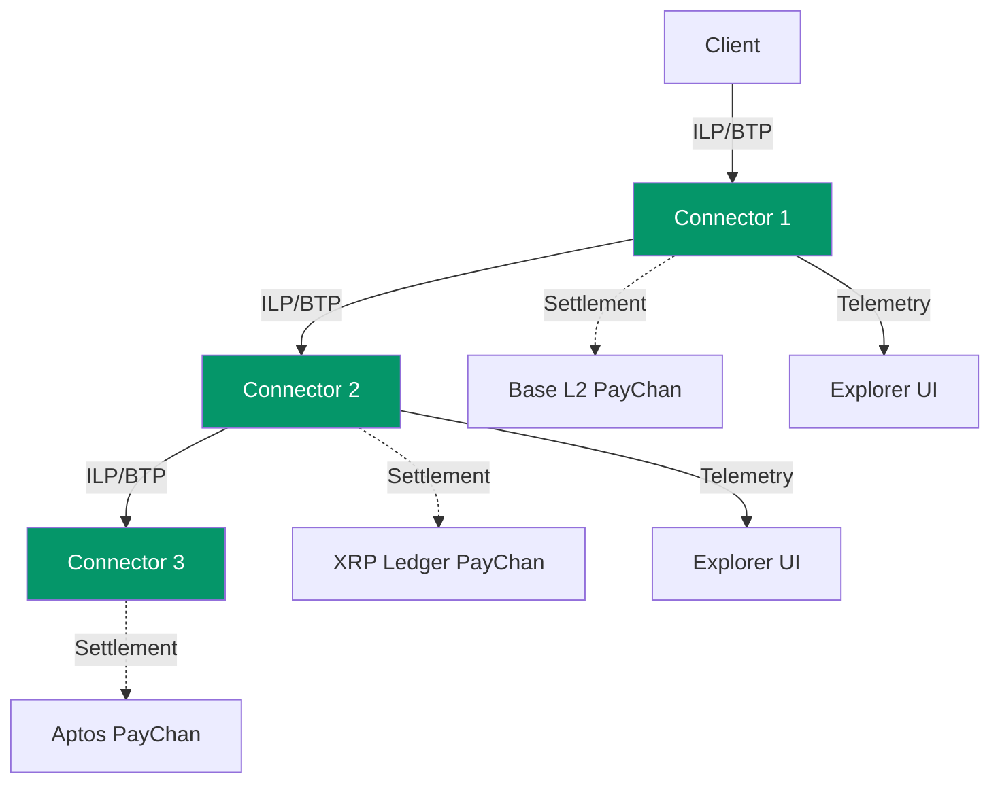

# ILP Connector

[](CHANGELOG.md)
[](https://github.com/yourusername/ilp-connector/actions)
[](https://www.typescriptlang.org/)
[](https://nodejs.org/)
[](LICENSE)

> A TypeScript implementation of an Interledger Protocol (ILP) connector with tri-chain settlement and real-time observability.

---

## TL;DR

**ILP Connector** is a production-ready implementation of the Interledger Protocol that routes payments across different payment networks. It features **tri-chain settlement** (EVM, XRP, Aptos), **TigerBeetle accounting**, and a built-in **Explorer UI** for real-time packet inspection.

### Key Capabilities

- **Multi-Hop Payment Routing** — RFC-compliant ILPv4 with BTP WebSocket protocol
- **Tri-Chain Settlement** — Instant finality on Base L2, XRP Ledger, and Aptos
- **Double-Entry Accounting** — TigerBeetle integration for balance tracking
- **Explorer UI** — Real-time packet inspection, settlement monitoring, and payment channel visualization

---

## Protocol Components

### Interledger Protocol (ILP) & Bilateral Transfer Protocol (BTP)

**ILP** is a protocol suite for routing payments across different payment networks, similar to how IP routes data packets across networks. This implementation uses **ILPv4** with **BTP** for connector-to-connector communication.

#### Key Concepts

- **ILP Packets** — Three types: PREPARE (initiate), FULFILL (confirm), REJECT (fail)
- **Hashed Timelock Agreements (HTLCs)** — Cryptographic escrow ensuring atomic payments
- **Multi-Hop Routing** — Payments route through intermediate connectors without trust
- **Address Format** — Hierarchical addressing (e.g., `g.connector.alice`)

#### Implementation

- **RFC-0027** ILPv4 packet format and routing logic
- **RFC-0023** BTP WebSocket protocol for connector peering
- **RFC-0030** OER (Octet Encoding Rules) for binary serialization

#### Official Documentation

- [Interledger.org](https://interledger.org) — Official protocol website
- [RFC Index](https://interledger.org/rfcs/) — Complete specification library
- [RFC-0027: ILPv4](https://interledger.org/rfcs/0027-interledger-protocol-4/) — Core protocol spec
- [RFC-0023: BTP](https://interledger.org/rfcs/0023-bilateral-transfer-protocol/) — Bilateral transfer protocol
- [Rafiki](https://rafiki.dev) — Production ILP implementation (for comparison)

---

### Payment Channels

**Payment channels** enable instant, low-cost cryptocurrency transfers between two parties by conducting most transactions off-chain and settling net balances on-chain.

#### How Payment Channels Work

1. **Open** — Both parties lock funds in a multi-signature smart contract
2. **Transact** — Exchange signed balance proofs off-chain (instant, free)
3. **Settle** — Submit final balance proof to blockchain (cooperative close)
4. **Dispute** — Challenge invalid proofs with timeout mechanism (non-cooperative close)

#### Tri-Chain Settlement

**1. EVM Payment Channels (Base L2)**

- XRP-style payment channels as Solidity smart contracts
- Deployed on Base L2 (Ethereum Layer 2)
- Sub-cent transaction fees, instant finality

**2. XRP Payment Channels (PayChan)**

- Native XRP Ledger payment channels
- Claim-based settlement with signature verification
- High throughput, low latency

**3. Aptos Move Payment Channels**

- Move smart contract modules on Aptos
- 160,000+ TPS capability, sub-second finality

#### Official Documentation

- [XRP Ledger PayChan](https://xrpl.org/payment-channels.html) — XRP payment channel docs
- [Base L2](https://base.org) — Ethereum Layer 2 network
- [Aptos](https://aptos.dev) — Aptos blockchain documentation

---

## Architecture Overview



### Component Responsibilities

| Component            | Role                             | Protocols                    |
| -------------------- | -------------------------------- | ---------------------------- |
| **ILP Connectors**   | Route packets between peers      | ILPv4, BTP, HTLC escrow      |
| **Payment Channels** | Off-chain settlement layer       | EVM, XRP PayChan, Aptos Move |
| **TigerBeetle**      | Double-entry accounting database | Financial transactions       |
| **Explorer UI**      | Real-time network monitoring     | WebSocket, React, shadcn/ui  |

---

## Monorepo Structure

```
ilp-connector/
├── packages/
│   ├── connector/          # ILP Connector
│   │   ├── src/
│   │   │   ├── core/       # ConnectorNode, PacketHandler
│   │   │   ├── btp/        # BTP Server/Client
│   │   │   ├── routing/    # RoutingTable
│   │   │   ├── settlement/ # Multi-chain settlement
│   │   │   ├── explorer/   # Explorer server
│   │   │   └── telemetry/  # Event emission
│   │   └── explorer-ui/    # React UI with shadcn/ui
│   └── shared/             # Shared types and utilities
│       └── src/types/      # TypeScript interfaces
├── scripts/                # Test runners
├── docker/                 # Docker Compose configurations
└── docs/                   # Documentation
    └── prd/                # Product requirement docs (epics)
```

---

## Prerequisites

- **Docker** (v27.0.0+)
  - **Linux/Windows:** Docker Desktop or Docker Engine
  - **macOS:** [OrbStack](https://orbstack.dev/) (recommended) or Docker Desktop
- **Node.js** (v22.11.0 LTS)
- **npm** (v10.9.0+)
- **8GB RAM** minimum (16GB recommended)
- **10GB disk space** for Docker images

### macOS Development Setup

**⚠️ Important for macOS developers:** TigerBeetle (our accounting database) requires native installation on macOS. Docker Desktop and OrbStack both have compatibility issues with TigerBeetle's `io_uring` requirements.

**✅ Recommended Solution:** Install TigerBeetle natively (no Docker needed for the database).

**Quick Setup (5 minutes):**

```bash
# 1. Install TigerBeetle binary
npm run tigerbeetle:install

# 2. Start development (TigerBeetle + Connector)
npm run dev
```

**Why Native Installation?**

- ✅ Perfect dev/production parity (same TigerBeetle binary)
- ✅ Zero Docker compatibility issues
- ✅ Simple one-command setup
- ✅ Works on both Apple Silicon (M1/M2/M3) and Intel Macs
- ✅ Production uses containerized TigerBeetle (same binary, different deployment)

**What Gets Installed:**

- TigerBeetle binary → `/usr/local/bin/tigerbeetle`
- Data directory → `~/.tigerbeetle/data`
- Auto-starts with `npm run dev`

**📚 Full Guide:** [macOS Development Setup](docs/guides/local-development-macos.md)

### Port Requirements

| Port      | Service                   |
| --------- | ------------------------- |
| 8201-8203 | Connector APIs            |
| 9200-9203 | Explorer UIs              |
| 8545      | Anvil (local EVM testnet) |

---

## Installation

### 1. Clone Repository

```bash
git clone https://github.com/yourusername/ilp-connector.git
cd ilp-connector
```

### 2. Install Dependencies

```bash
# Install all workspace dependencies
npm install

# Build TypeScript packages
npm run build
```

### 3. Run Tests

```bash
# Run unit tests
npm test

# Run integration tests
npm run test:integration
```

---

## Project Status

See [Epic List](docs/prd/epic-list.md) for the complete list of features.

### Completed Features

- **Epics 1-2, 4-5, 10** — Core ILP implementation, BTP protocol, CI/CD
- **Epics 6-9, 27-28** — Settlement infrastructure (TigerBeetle, EVM, XRP, Aptos)
- **Epics 3, 14-15, 29** — Explorer UI with real-time observability

All 15 epics are **completed**. The connector is feature-complete.

---

## Documentation

### Core Documentation

- [Epic List](docs/prd/epic-list.md) — Complete feature list

### Technical Documentation

- [ILP Packet Routing](docs/architecture/core-workflows.md)
- [Components](docs/architecture/components.md)
- [Settlement Engines](docs/architecture/external-apis.md)

### Development

- [Contributing Guidelines](CONTRIBUTING.md)
- [Testing Guide](docs/architecture/test-strategy-and-standards.md)

---

## Technology Stack

### Runtime & Languages

- **TypeScript 5.3.3** — Type-safe development
- **Node.js 22.11.0 LTS** — Runtime environment
- **Docker & Docker Compose** — Containerization and orchestration

### Core Dependencies

- **tigerbeetle-node** — Double-entry accounting
- **ws** — WebSocket (BTP protocol)
- **pino** — Structured logging

### Blockchain SDKs

- **viem** — EVM interaction (Base L2)
- **xrpl** — XRP Ledger client
- **@aptos-labs/ts-sdk** — Aptos blockchain client

### Frontend

- **React 18** — UI framework
- **Vite** — Build tool
- **shadcn/ui** — Component library
- **TailwindCSS** — Styling

---

## Interledger Protocol References

This implementation follows official Interledger RFCs:

- [RFC-0001](https://interledger.org/rfcs/0001-interledger-architecture/) — Interledger Architecture
- [RFC-0027](https://interledger.org/rfcs/0027-interledger-protocol-4/) — ILPv4 Core Protocol
- [RFC-0023](https://interledger.org/rfcs/0023-bilateral-transfer-protocol/) — BTP WebSocket Protocol
- [RFC-0030](https://interledger.org/rfcs/0030-notes-on-oer-encoding/) — OER Encoding
- [RFC-0038](https://interledger.org/rfcs/0038-settlement-engines/) — Settlement Engines

---

## Contributing

We welcome contributions! Please see [CONTRIBUTING.md](CONTRIBUTING.md) for guidelines.

### Development Setup

```bash
# Install dependencies
npm install

# Run tests
npm test

# Run linter
npm run lint

# Build all packages
npm run build
```

---

## License

MIT License - see [LICENSE](LICENSE) file for details.

---

## References

### Official Protocol Documentation

- [Interledger.org](https://interledger.org) — Interledger Protocol
- [Base](https://base.org) — Ethereum Layer 2
- [XRP Ledger](https://xrpl.org) — XRP blockchain
- [Aptos](https://aptos.dev) — Aptos blockchain

### Related Projects

- [Rafiki](https://rafiki.dev) — Production ILP implementation
- [TigerBeetle](https://tigerbeetle.com) — Financial accounting database

### Research & Standards

- [Interledger RFCs](https://interledger.org/rfcs/) — Protocol specifications

---

## Support & Community

- **GitHub Issues:** [Report bugs or request features](https://github.com/yourusername/ilp-connector/issues)
- **Documentation:** [Full docs](docs/)
