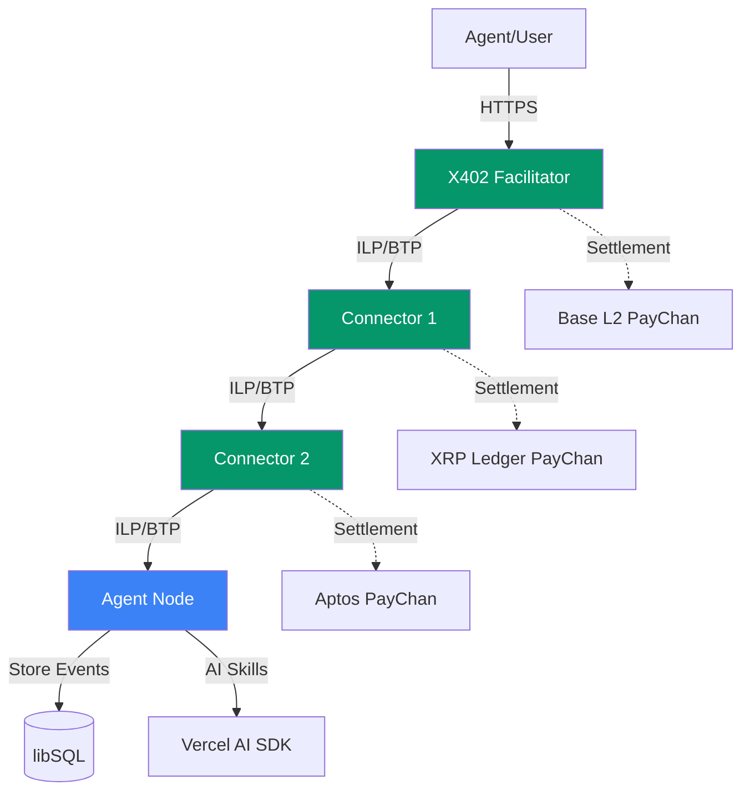

# M2M - Machine to Machine Protocol

[](CHANGELOG.md)
[](https://github.com/yourusername/m2m/actions)
[](https://www.typescriptlang.org/)
[](https://nodejs.org/)
[](LICENSE)

> **v0.1.0 Release** - Multi-hop ILP routing with tri-chain settlement, Agent Society Protocol, and private messaging. See [CHANGELOG.md](CHANGELOG.md) for release notes.

---

## TL;DR

**M2M** fuses payment routing with decentralized communication to create autonomous agent networks. Agents route micropayments and messages through the same topology using **Interledger Protocol (ILP)**, **Nostr events**, and **multi-chain settlement** (EVM, XRP, Aptos). The result: a protocol stack where machines compensate each other for services—queries, storage, compute, streaming—without trusted intermediaries.

### What Makes M2M Different

- **Unified Architecture** — Agents are simultaneously ILP connectors, Nostr relays, and settlement executors
- **No New Token** — Uses existing blockchain settlement (ETH on Base L2, XRP, Aptos)
- **Proven Protocols** — Built on Interledger Protocol and Nostr's decentralized messaging
- **Cryptographic Guarantees** — Every payment uses hashed timelock agreements (HTLCs) for atomic settlement
- **Multi-Chain Settlement** — Only implementation with EVM + XRP + Aptos payment channels

### Key Capabilities

- **Multi-Hop Payment Routing** — RFC-compliant ILPv4 with BTP WebSocket protocol
- **Tri-Chain Settlement** — Instant finality on Base L2, XRP Ledger, and Aptos
- **Agent Society Protocol** — TOON-serialized Nostr events inside ILP packets
- **Private Messaging** — NIP-59 giftwrap with 3-layer encryption routed through ILP
- **Workflow Orchestration** — Multi-hop image processing with cross-chain settlement
- **Agent Explorer UI** — Real-time packet inspection, event browsing, and settlement monitoring

---

## Quick Start Demos

### 🔒 Private Messaging Demo (Epic 32)

End-to-end encrypted messaging with NIP-59 giftwrap and multi-hop ILP routing.

```bash
# Start the demo (builds and deploys all services)
./scripts/run-messaging-demo.sh

# Access the messenger
open http://localhost:5173/messenger

# Stop the demo
./scripts/run-messaging-demo.sh stop
```

**What You'll See:**

- Client-side NIP-59 encryption (3 layers: rumor → seal → giftwrap)
- Real-time routing visualization across 4 hops
- ILP payments (300 msat per message ≈ $0.03 USD)
- Automatic settlement on Aptos testnet
- Privacy-preserving ephemeral keys

**Network Topology:**

```
Alice (Browser) → Facilitator → Connector 1 → Connector 2 → Bob Agent → Bob (Browser)
```

**Access Points:**

- **Alice's UI:** http://localhost:5173/messenger
- **Bob's UI:** http://localhost:5174/messenger?user=bob
- **Facilitator Explorer:** http://localhost:9200
- **Connector 1 Explorer:** http://localhost:9201
- **Connector 2 Explorer:** http://localhost:9202
- **Bob Agent Explorer:** http://localhost:9203

**Demo Guide:** [docs/demos/epic-32-demo-script.md](docs/demos/epic-32-demo-script.md)

---

### 🖼️ Workflow Processing Demo (Epic 31)

Multi-hop image processing workflow with cross-chain ILP settlement.

```bash
# Start the demo
./scripts/run-workflow-demo.sh

# Access the client UI
open http://localhost:3000

# Stop the demo
docker compose -f docker-compose-workflow-demo.yml down -v
```

**What You'll See:**

- Upload an image and select processing options (resize, watermark, optimize)
- Watch payment route through 3 hops via ILP
- Real-time settlement on Aptos local testnet
- Download processed image with Sharp library

**Network Topology:**

```
Client (Browser) → Facilitator → Connector 1 → Connector 2 → Workflow Peer
```

**Access Points:**

- **Client UI:** http://localhost:3000
- **Facilitator API:** http://localhost:3001
- **Facilitator Explorer:** http://localhost:9200
- **Connector 1 Explorer:** http://localhost:9201
- **Connector 2 Explorer:** http://localhost:9202
- **Workflow Peer Explorer:** http://localhost:9203

**Demo Guide:** [docs/workflow-demo-guide.md](docs/workflow-demo-guide.md)

---

## Protocol Components

### 🔗 Interledger Protocol (ILP) & Bilateral Transfer Protocol (BTP)

**ILP** is a protocol suite for routing payments across different payment networks, similar to how IP routes data packets across networks. M2M implements **ILPv4** with **BTP** for connector-to-connector communication.

#### Key Concepts

- **ILP Packets** — Three types: PREPARE (initiate), FULFILL (confirm), REJECT (fail)
- **Hashed Timelock Agreements (HTLCs)** — Cryptographic escrow ensuring atomic payments
- **Multi-Hop Routing** — Payments route through intermediate connectors without trust
- **Address Format** — Hierarchical addressing (e.g., `g.agent.alice.query`)

#### M2M Implementation

- **RFC-0027** ILPv4 packet format and routing logic
- **RFC-0023** BTP WebSocket protocol for connector peering
- **RFC-0030** OER (Octet Encoding Rules) for binary serialization
- Social graph-based routing using Nostr follow relationships

#### Official Documentation

- [Interledger.org](https://interledger.org) — Official protocol website
- [RFC Index](https://interledger.org/rfcs/) — Complete specification library
- [RFC-0027: ILPv4](https://interledger.org/rfcs/0027-interledger-protocol-4/) — Core protocol spec
- [RFC-0023: BTP](https://interledger.org/rfcs/0023-bilateral-transfer-protocol/) — Bilateral transfer protocol
- [Rafiki](https://rafiki.dev) — Production ILP implementation (for comparison)

---

### 💰 Payment Channels

**Payment channels** enable instant, low-cost cryptocurrency transfers between two parties by conducting most transactions off-chain and settling net balances on-chain. M2M implements payment channels on three blockchains.

#### How Payment Channels Work

1. **Open** — Both parties lock funds in a multi-signature smart contract
2. **Transact** — Exchange signed balance proofs off-chain (instant, free)
3. **Settle** — Submit final balance proof to blockchain (cooperative close)
4. **Dispute** — Challenge invalid proofs with timeout mechanism (non-cooperative close)

#### M2M Implementation

M2M supports **tri-chain settlement** with payment channels on:

**1. EVM Payment Channels (Base L2)**

- XRP-style payment channels as Solidity smart contracts
- Deployed on Base L2 (Ethereum Layer 2)
- Sub-cent transaction fees, instant finality
- Epic 8: [docs/prd/epic-8-evm-payment-channels-base-l2.md](docs/prd/epic-8-evm-payment-channels-base-l2.md)

**2. XRP Payment Channels (PayChan)**

- Native XRP Ledger payment channels
- Claim-based settlement with signature verification
- High throughput, low latency
- Epic 9: [docs/prd/epic-9-xrp-payment-channels.md](docs/prd/epic-9-xrp-payment-channels.md)

**3. Aptos Move Payment Channels**

- Move smart contract modules on Aptos
- 160,000+ TPS capability, sub-second finality
- Optimized for AI agent micropayments
- Epic 27: [docs/prd/epic-27-aptos-payment-channels.md](docs/prd/epic-27-aptos-payment-channels.md)

#### Official Documentation

- [Payment Channels Explained (Bitcoin Wiki)](https://en.bitcoin.it/wiki/Payment_channels)
- [XRP Ledger PayChan](https://xrpl.org/payment-channels.html) — XRP payment channel docs
- [Base L2](https://base.org) — Ethereum Layer 2 network
- [Aptos](https://aptos.dev) — Aptos blockchain documentation
- [Lightning Network](https://lightning.network/) — Bitcoin payment channel network (for reference)

---

### 🌐 Nostr Protocol

**Nostr** (Notes and Other Stuff Transmitted by Relays) is a simple, open protocol for decentralized social networking and messaging. M2M uses Nostr for agent communication and event storage.

#### Key Concepts

- **Events** — Signed JSON objects with kinds (types), content, and metadata
- **Relays** — Servers that store and forward events (in M2M, agents ARE the relays)
- **Keypairs** — secp256k1 public/private keys for identity and signatures
- **NIPs** — Nostr Implementation Possibilities (protocol extensions)

#### M2M Implementation

M2M agents act as **unified Connector-Relays**:

- **Local Event Storage** — Each agent stores events in libSQL (SQLite fork)
- **TOON Serialization** — Events serialized with TOON format (40% smaller than JSON)
- **ILP Transport** — Nostr events routed through ILP packets instead of HTTP
- **Agent Society Protocol** — Epic 13 architecture combining ILP + Nostr

#### Nostr Event Kinds Used

- **Kind 1** — Text notes (chat messages)
- **Kind 3** — Follow lists (define routing topology)
- **Kind 10000** — Agent queries (request/response)
- **Kind 30001-30003** — Balance proof claims (settlement)
- **NIP-59** — Gift wrap encrypted messages (3-layer encryption)
- **NIP-90** — Data Vending Machine jobs (task delegation)

#### Official Documentation

- [Nostr Protocol](https://nostr.com) — Official protocol website
- [NIPs Repository](https://github.com/nostr-protocol/nips) — Nostr Implementation Possibilities
- [NIP-01: Basic Protocol](https://github.com/nostr-protocol/nips/blob/master/01.md) — Core specification
- [NIP-59: Gift Wrap](https://github.com/nostr-protocol/nips/blob/master/59.md) — Encrypted messaging
- [NIP-90: Data Vending Machines](https://github.com/nostr-protocol/nips/blob/master/90.md) — Job marketplace

---

### 📦 TOON (Tagged Object Oriented Notation)

**TOON** is a minimalist, LLM-friendly text serialization format designed for agent-to-agent communication. It's used in M2M to serialize Nostr events inside ILP packets.

#### Key Features

- **40% Smaller** — More compact than JSON (~60% size)
- **LLM-Readable** — Designed for language models to parse and generate
- **UTF-8 Native** — Clean text encoding without escaping
- **Tag-Based** — Uses tags instead of key-value pairs

#### TOON Format Example

**JSON (118 bytes):**

```json
{
  "id": "abc123",
  "kind": 1,
  "pubkey": "npub1xyz",
  "created_at": 1234567890,
  "content": "Hello world",
  "tags": [],
  "sig": "sig123"
}
```

**TOON (72 bytes - 39% smaller):**

```
event:abc123
kind:1
pubkey:npub1xyz
created_at:1234567890
content:Hello world
tags:
sig:sig123
```

#### M2M Implementation

- **Event Serialization** — All Nostr events serialized as TOON before ILP packet insertion
- **Packet Efficiency** — Smaller payloads = lower packet costs
- **AI Agent Friendly** — LLMs can directly read/write TOON without parsing overhead

#### Specification

TOON is a custom format developed for M2M. Specification details:

- Format: `key:value\n` pairs
- Arrays: `key:\n  item1\n  item2`
- Objects: Nested with indentation
- Encoding: UTF-8

**Reference Implementation:** [packages/shared/src/toon/](packages/shared/src/toon/)

---

## Architecture Overview



### Component Responsibilities

| Component            | Role                                | Protocols                    |
| -------------------- | ----------------------------------- | ---------------------------- |
| **X402 Facilitator** | HTTP-to-ILP gateway for web clients | HTTPS, ILPv4, BTP            |
| **ILP Connectors**   | Route packets between peers         | ILPv4, BTP, HTLC escrow      |
| **Agent Nodes**      | Unified connector-relay-executor    | ILP + Nostr + Settlement     |
| **Payment Channels** | Off-chain settlement layer          | EVM, XRP PayChan, Aptos Move |
| **libSQL Database**  | Local event storage per agent       | SQL, MVCC concurrency        |
| **Explorer UI**      | Real-time network monitoring        | WebSocket, React, shadcn/ui  |

---

## Monorepo Structure

```
m2m/
├── packages/
│   ├── connector/          # ILP Connector + Agent Server
│   │   ├── src/
│   │   │   ├── agent/      # Agent Society Protocol (Epic 13)
│   │   │   ├── facilitator/ # X402 Gateway (Epic 31)
│   │   │   ├── messaging/  # NIP-59 Private Messaging (Epic 32)
│   │   │   └── workflow/   # Workflow Orchestration (Epic 31)
│   │   ├── explorer-ui/    # React UI with shadcn/ui
│   │   └── client-ui/      # Workflow client UI
│   └── shared/             # Shared types and utilities
│       ├── src/types/      # TypeScript interfaces
│       └── src/toon/       # TOON serialization
├── scripts/                # Demo and test runners
│   ├── run-messaging-demo.sh
│   ├── run-workflow-demo.sh
│   └── run-docker-agent-test.sh
├── docker/                 # Docker Compose configurations
└── docs/                   # Documentation
    ├── prd/                # Product requirement docs (epics)
    ├── demos/              # Demo scripts and guides
    └── architecture/       # Architecture diagrams
```

---

## Prerequisites

- **Docker Desktop** (v27.0.0+)
- **Node.js** (v22.11.0 LTS)
- **npm** (v10.9.0+)
- **8GB RAM** minimum (16GB recommended)
- **10GB disk space** for Docker images

### Port Requirements

The demos use these ports (ensure they're available):

| Port               | Service                     | Demo      |
| ------------------ | --------------------------- | --------- |
| 3000               | Client UI                   | Workflow  |
| 3001-3003          | Facilitator APIs            | Both      |
| 5173-5174          | Messenger UIs               | Messaging |
| 8201-8203          | Connector/Agent APIs        | Both      |
| 9200-9203          | Explorer UIs                | Both      |
| 8545               | Anvil (Aptos local testnet) | Both      |
| 3000 (TigerBeetle) | Accounting DB               | Messaging |

---

## Installation

### 1. Clone Repository

```bash
git clone https://github.com/yourusername/m2m.git
cd m2m
```

### 2. Install Dependencies

```bash
# Install all workspace dependencies
npm install

# Build TypeScript packages
npm run build
```

### 3. Run a Demo

Choose a demo to start with:

```bash
# Private Messaging Demo (recommended first demo)
./scripts/run-messaging-demo.sh

# OR Workflow Processing Demo
./scripts/run-workflow-demo.sh
```

---

## Project Status

See [Epic List](docs/prd/epic-list.md) for the complete roadmap.

### ✅ Completed Epics

- **Epics 1-2, 4-10** — Core ILP implementation, BTP protocol, Docker deployment
- **Epics 8, 9, 27-30** — Tri-chain settlement (EVM, XRP, Aptos)
- **Epics 13-16** — Agent Society Protocol, Explorer UI, AI agent integration
- **Epic 31** — Workflow demo with multi-hop routing
- **Epic 32** — Private messaging with NIP-59 giftwrap

### 🚧 In Progress

- **Epic 17** — NIP-90 DVM compatibility
- **Epic 23** — NIP-56XX payment streams protocol

### 📋 Roadmap

- **Epic 18** — Agent capability discovery
- **Epic 20** — Multi-agent coordination
- **Epic 22** — Emergent workflow composition
- **Epic 24** — Live streaming infrastructure (Livepeer integration)
- **Epic 25** — zkVM compute verification (RISC Zero/SP1)
- **Epic 26** — Agent service markets with staking

---

## Documentation

### Core Documentation

- [Project Overview](docs/PROJECT-OVERVIEW.md) — Full project description and capabilities
- [Problem Statement](docs/PROBLEM-STATEMENT.md) — Market analysis and gaps addressed
- [Elevator Pitch](docs/ELEVATOR-PITCH.md) — Quick summary for different audiences
- [Epic List](docs/prd/epic-list.md) — Complete roadmap

### Demo Guides

- [Epic 32: Private Messaging Demo](docs/demos/epic-32-demo-script.md)
- [Epic 31: Workflow Processing Demo](docs/workflow-demo-guide.md)
- [Docker Agent Society Test](docs/architecture/docker-agent-society-test.md)

### Technical Documentation

- [ILP Packet Routing](docs/architecture/ilp-routing.md)
- [Payment Channel Integration](docs/architecture/payment-channels.md)
- [Agent Society Protocol](docs/prd/epic-13-agent-society-protocol.md)
- [Settlement Engine API](docs/architecture/settlement-engines.md)

### Development

- [Contributing Guidelines](CONTRIBUTING.md)
- [Development Workflow](docs/development-workflow.md)
- [Testing Guide](docs/testing-guide.md)

---

## Technology Stack

### Runtime & Languages

- **TypeScript 5.3.3** — Type-safe development
- **Node.js 22.11.0 LTS** — Runtime environment
- **Docker & Docker Compose** — Containerization and orchestration

### Core Dependencies

- **@interledger/open-payments** — ILP packet handling
- **tigerbeetle-node** — Double-entry accounting
- **nostr-tools** — Nostr event signing and verification
- **@vercel/ai** — AI agent orchestration

### Blockchain SDKs

- **viem** — EVM interaction (Base L2)
- **xrpl** — XRP Ledger client
- **@aptos-labs/ts-sdk** — Aptos blockchain client

### Frontend

- **React 18** — UI framework
- **Vite** — Build tool
- **shadcn/ui** — Component library
- **TailwindCSS** — Styling

### Database

- **libSQL** — SQLite fork with MVCC for event storage

---

## Interledger Protocol References

This implementation follows official Interledger RFCs:

- [RFC-0001](https://interledger.org/rfcs/0001-interledger-architecture/) — Interledger Architecture
- [RFC-0027](https://interledger.org/rfcs/0027-interledger-protocol-4/) — ILPv4 Core Protocol
- [RFC-0023](https://interledger.org/rfcs/0023-bilateral-transfer-protocol/) — BTP WebSocket Protocol
- [RFC-0030](https://interledger.org/rfcs/0030-notes-on-oer-encoding/) — OER Encoding
- [RFC-0038](https://interledger.org/rfcs/0038-settlement-engines/) — Settlement Engines

---

## Contributing

We welcome contributions! Please see [CONTRIBUTING.md](CONTRIBUTING.md) for guidelines.

### Development Setup

```bash
# Install dependencies
npm install

# Run tests
npm test

# Run linter
npm run lint

# Build all packages
npm run build
```

### Running Tests

```bash
# Unit tests
npm run test:unit

# Integration tests
npm run test:integration

# Docker agent society test
./scripts/run-docker-agent-test.sh
```

---

## License

MIT License - see [LICENSE](LICENSE) file for details.

---

## References

### Official Protocol Documentation

- [Interledger.org](https://interledger.org) — Interledger Protocol
- [Nostr Protocol](https://nostr.com) — Nostr specification
- [Base](https://base.org) — Ethereum Layer 2
- [XRP Ledger](https://xrpl.org) — XRP blockchain
- [Aptos](https://aptos.dev) — Aptos blockchain

### Related Projects

- [Rafiki](https://rafiki.dev) — Production ILP implementation
- [Livepeer](https://livepeer.org) — Decentralized video infrastructure
- [RISC Zero](https://risczero.com) — zkVM for compute verification
- [TigerBeetle](https://tigerbeetle.com) — Financial accounting database

### Research & Standards

- [Interledger RFCs](https://interledger.org/rfcs/) — Protocol specifications
- [Nostr NIPs](https://github.com/nostr-protocol/nips) — Nostr Implementation Possibilities
- [Payment Channels (Bitcoin Wiki)](https://en.bitcoin.it/wiki/Payment_channels)

---

## Support & Community

- **GitHub Issues:** [Report bugs or request features](https://github.com/yourusername/m2m/issues)
- **Discussions:** [Ask questions and share ideas](https://github.com/yourusername/m2m/discussions)
- **Documentation:** [Full docs](docs/)

---

**Built with ❤️ for the autonomous agent economy**
