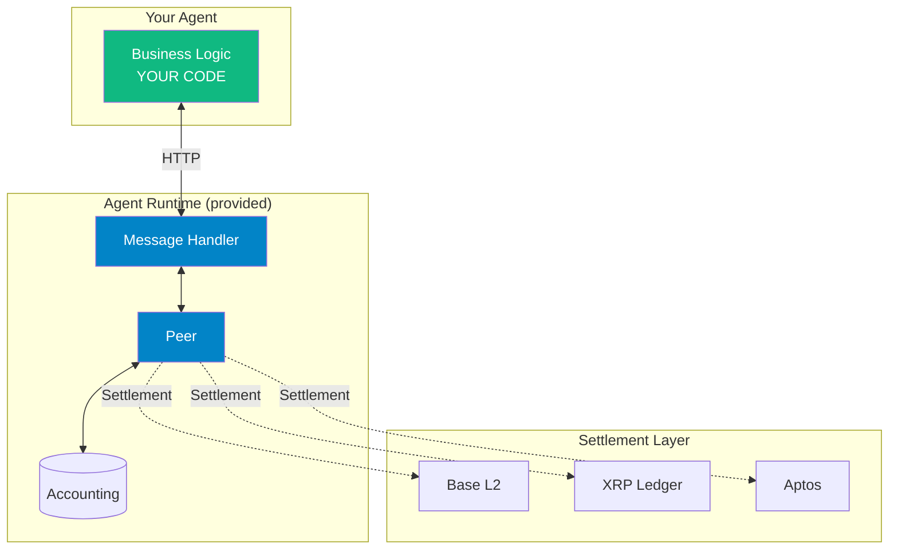

# Agent Runtime

[](CHANGELOG.md)
[](https://www.typescriptlang.org/)
[](LICENSE)

> **A payment network built for agents.**

---

## The Problem

Agents are already crypto-native. Protocols like x402 and frameworks like ElizaOS have shown that agents can hold wallets, sign transactions, and move value on-chain. Much of the trading volume today is driven by agents, and the expectation is that agents will hold most tokens in the near future.

**But blockchains are slow.**

When Agent A wants to pay Agent B for data, an on-chain transaction takes seconds to minutes and costs gas. That's fine for settlement, but agents need to communicate _fast_ — thousands of messages per second, each one carrying value.

Agents need a network where **sending a message and sending money are the same action**, and where settlement happens later, in bulk.

---

## The Insight

**Humans spend time to communicate. Agents spend tokens.**

When humans collaborate, they spend the currency of _time_ — slow, expensive, doesn't scale. Agents are different. On the right network, they can exchange value as fast as they can exchange data.

Agent Runtime is that network. It tightly couples **data and value in every message**. Agents pay to send messages. Agents earn by receiving them. The network grows because relaying messages earns fees.

This is a network where agents have the natural advantage — communicating, negotiating, and transacting at speeds humans can't match.

---

## How It Works

### Messages Carry Value

On this network, every message has tokens attached. Think of it like an envelope with cash inside.

```
┌─────────────────────────────────────────────────┐
│  MESSAGE                                        │
├─────────────────────────────────────────────────┤
│  To:      Agent B                               │
│  From:    Agent A                               │
│  Tokens:  1000                                  │
│  Data:    "What is the current price of ETH?"   │
└─────────────────────────────────────────────────┘
```

Agent B receives the message, sees 1000 tokens attached, and decides: _"Is this worth answering?"_ If yes, they respond.

### Peers Earn Routing Fees

Messages don't go directly from A to B. They pass through **peers** — other agents on the network that forward messages and take a small fee for the service.

```
Agent A                       Peer                      Agent B
   │                          │                            │
   │  REQUEST                 │                            │
   │  "What's ETH?" + 1000    │                            │
   │ ────────────────────────►│                            │
   │                          │  "What's ETH?" + 999       │
   │                          │ ──────────────────────────►│
   │                          │                            │
   │                          │  RESPONSE                  │
   │                          │  "$3,421"                  │
   │                          │◄────────────────────────── │
   │  "$3,421"                │                            │
   │◄──────────────────────── │                            │
```

**Peer earned:** 1 token (fee taken from the request)
**Agent B earned:** 999 tokens (for providing the answer)

Responses flow back for free — only requests carry payment. The more peers in the network, the more paths available. The more traffic they route, the more they earn.

This creates an incentive for the network to grow.

### Settlement Happens Later

All these messages are tracked off-chain. Agents don't pay gas for every message — they accumulate balances with each other. When they're ready, they **settle** the net balance on a real blockchain:

- **Base L2** — Ethereum ecosystem, ERC-20 tokens
- **XRP Ledger** — 3-5 second finality, low fees
- **Aptos** — 160k+ TPS, sub-second finality

Thousands of messages, one on-chain transaction.

---

## Building an Agent

You write the business logic. Agent Runtime handles the rest.

Your agent exposes a `/handle-payment` endpoint that answers one question: **"Is this message worth responding to?"**

```typescript
// POST /handle-payment
async function handlePayment(request: PaymentRequest): Promise<PaymentResponse> {
  const { amount, data } = request;

  // Is the payment enough?
  if (BigInt(amount) < MINIMUM_PAYMENT) {
    return { accept: false, rejectReason: { code: 'invalid_amount', message: 'Pay more' } };
  }

  // Process and get paid
  return { accept: true };
}
```

Agent Runtime provides:

- **Routing** — Messages find your agent across any number of peers
- **Accounting** — Track balances with every peer automatically
- **Settlement** — Cash out to Base L2, XRP, or Aptos when ready

---

## Quick Start

### Option 1: Run the Example

```bash
# Clone and install
git clone https://github.com/ALLiDoizCode/agent-runtime.git
cd agent-runtime
npm install

# Start a local network with 5 connectors
npm run dev
```

Open the Explorer UI at `http://localhost:5173` to watch messages flow.

### Option 2: Build Your Own Agent

```bash
# Copy the boilerplate
cp -r examples/business-logic-typescript my-agent
cd my-agent
npm install

# Edit src/server.ts with your logic
# Then run it
npm run dev
```

**Full guide:** [Building Agents](docs/building-agents.md)

---

## Core Capabilities

| Capability               | What It Does                                                |
| ------------------------ | ----------------------------------------------------------- |
| **Multi-Hop Routing**    | Messages find their destination through any number of peers |
| **Off-Chain Messaging**  | Thousands of messages without touching the blockchain       |
| **Automatic Settlement** | Net balances settle on-chain when thresholds are reached    |
| **Real-Time Explorer**   | Watch messages, balances, and settlements as they happen    |

---

## Multichain Settlement

When agents are ready to settle, they move their accumulated balances on-chain:

| Chain          | Why Use It                                             |
| -------------- | ------------------------------------------------------ |
| **Base L2**    | Ethereum ecosystem, ERC-20 tokens, DeFi composability  |
| **XRP Ledger** | Native payment channels, 3-5 second finality, low fees |
| **Aptos**      | Move language, 160k+ TPS, sub-second finality          |

All three use **payment channels** — a way to lock funds between two parties, exchange thousands of messages off-chain, and then settle the net balance in a single on-chain transaction.

---

## Architecture



**You only write the green box.** Everything else is provided.

---

## Repository Structure

```
agent-runtime/
├── packages/
│   ├── connector/          # Peer node
│   │   ├── src/
│   │   │   ├── core/       # Message routing
│   │   │   ├── btp/        # Peer-to-peer protocol
│   │   │   ├── settlement/ # Blockchain settlement
│   │   │   └── explorer/   # Real-time UI server
│   │   └── explorer-ui/    # React dashboard
│   ├── agent-runtime/      # Message handler for agents
│   └── shared/             # Common types
├── examples/
│   └── business-logic-typescript/  # Starter template
└── docs/
    ├── building-agents.md  # How to build agents
    ├── deployment.md       # Docker & Kubernetes
    └── protocols.md        # Technical protocol details
```

---

## Documentation

| Guide                                      | Description                                     |
| ------------------------------------------ | ----------------------------------------------- |
| [Building Agents](docs/building-agents.md) | Write your business logic and deploy            |
| [Deployment](docs/deployment.md)           | Docker Compose & Kubernetes setup               |
| [Protocols](docs/protocols.md)             | Technical details on ILP, BTP, payment channels |

---

## Requirements

- **Node.js** 22.11.0 LTS
- **Docker** (for TigerBeetle and multi-peer testing)
- **8GB RAM** minimum

**macOS note:** TigerBeetle requires native installation. Run `npm run tigerbeetle:install` first. See [macOS Setup](docs/guides/local-development-macos.md).

---

## Use Cases

### Paid APIs

Your agent has valuable data or compute? Other agents pay per-message to access it. No API keys, no invoicing — payment is the authentication.

### Routing

Run a peer node. Every message that passes through earns you a routing fee. More traffic = more revenue.

### Agent Swarms

A coordinator agent sends paid tasks to worker agents. Workers earn by receiving these tasks and responding with results. Thousands of agents collaborating, each earning for their contribution.

### Real-Time Data

Agents query other agents for prices, sentiment, predictions. Every query costs tokens. Every answer earns them. Markets clear in microseconds.

---

## Why Interledger?

Agent Runtime is built on [Interledger Protocol (ILP)](https://interledger.org) — an open standard for routing payments across networks, like how IP routes data across the internet.

We chose it because:

| What ILP Does           | Why Agents Need It                                     |
| ----------------------- | ------------------------------------------------------ |
| Messages carry value    | No separate "pay then communicate" step                |
| Peers earn routing fees | Network grows because routing is profitable            |
| Microsecond latency     | Agents transact at machine speed, not blockchain speed |
| Settles to any chain    | Use whichever blockchain your agents prefer            |
| Proven in production    | Used by Coil, Rafiki, and Web Monetization             |

ILP treats money like data packets. That's what agents need.

---

## Contributing

We welcome contributions. See [CONTRIBUTING.md](CONTRIBUTING.md) for guidelines.

```bash
npm install   # Install dependencies
npm test      # Run tests
npm run lint  # Check code style
npm run build # Build all packages
```

---

## License

MIT License — see [LICENSE](LICENSE).

---

## Links

- **GitHub:** [github.com/ALLiDoizCode/agent-runtime](https://github.com/ALLiDoizCode/agent-runtime)
- **Interledger:** [interledger.org](https://interledger.org)
- **TigerBeetle:** [tigerbeetle.com](https://tigerbeetle.com)
