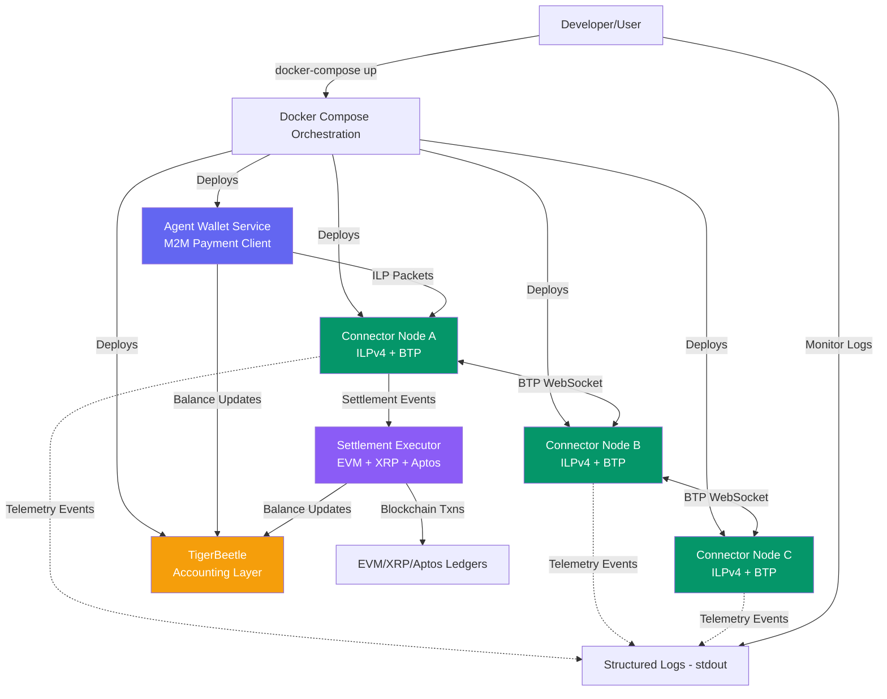

# High Level Architecture

## Technical Summary

The system employs a **microservices architecture deployed via Docker containers** with an observability-first design philosophy. Multiple independent ILP connector nodes communicate using BTP (RFC-0023) over WebSocket, emitting structured telemetry events for monitoring and debugging. The architecture prioritizes developer experience through comprehensive structured logging, zero-configuration network deployment, and agent wallet integration for machine-to-machine payments. Built entirely in TypeScript on Node.js, the system leverages in-memory state for connector routing while supporting persistent agent wallet balances via TigerBeetle. The system supports tri-chain settlement capabilities (EVM, XRP, and Aptos payment channels) and configurable network topologies from linear chains to full mesh networks.

**Note:** Dashboard visualization deferred - see DASHBOARD-DEFERRED.md in root

## High Level Overview

**Architectural Style:** **Containerized Microservices with Event-Driven Telemetry**

1. **Repository Structure:** Monorepo (npm workspaces) containing `packages/connector`, `packages/agent-wallet`, and `packages/shared`
   - Rationale: Simplifies dependency management, enables TypeScript type sharing across packages, streamlines single-developer workflow

2. **Service Architecture:**
   - N identical connector containers (each running ILPv4 + BTP implementation)
   - Agent wallet service (machine-to-machine payment capabilities)
   - Settlement engines (EVM, XRP, and Aptos payment channels)
   - TigerBeetle accounting layer (persistent balance tracking)
   - No shared routing state - each connector maintains in-memory routing tables

3. **Primary Data Flow:**

   ```
   Agent wallet initiates payment → Connector A receives via BTP
   → Connector A routes packet (consults routing table)
   → Connector A forwards to Connector B via BTP WebSocket
   → Both emit telemetry events (structured logging)
   → Telemetry logged to stdout for monitoring
   → Settlement triggers when balance threshold reached
   → Payment channel claim signed and transmitted off-chain
   ```

4. **Key Architectural Decisions:**
   - **Hybrid persistence:** In-memory routing tables, persistent agent wallet balances via TigerBeetle
   - **Push-based telemetry:** Connectors emit events to structured logging (not pull-based polling)
   - **Docker-first deployment:** Container orchestration via Docker Compose
   - **WebSocket-centric communication:** BTP uses WebSocket (RFC-0023), telemetry emitted to stdout
   - **Tri-chain settlement:** EVM payment channels (Epic 8), XRP payment channels (Epic 9), and Aptos payment channels (Epic 13)
   - **Dashboard deferred:** Visualization tooling deferred to focus on core payment functionality

## High Level Project Diagram



## Architectural and Design Patterns

1. **Microservices Architecture (Containerized)**
   - Each connector node runs as independent Docker container
   - Services communicate via WebSocket (BTP protocol + telemetry)
   - _Rationale:_ Aligns with PRD requirement for deploying N nodes flexibly; enables network topology experimentation; supports independent scaling and isolation

2. **Event-Driven Telemetry**
   - Connectors emit events (PACKET_RECEIVED, PACKET_SENT, ROUTE_LOOKUP) to structured logging asynchronously
   - Events logged to stdout for consumption by external monitoring tools
   - _Rationale:_ Decouples observability from packet processing; enables future extensibility (monitoring dashboards, log aggregation systems)

3. **Repository Pattern (for Routing Table Management)**
   - Abstract routing table operations behind interface
   - In-memory implementation for MVP, could swap for Redis/database later
   - _Rationale:_ Enables testing (mock routing table), future migration flexibility, clear separation of routing logic from storage

4. **Observer Pattern (for BTP Connection State)**
   - BTP clients emit connection lifecycle events (connected, disconnected, error)
   - Packet handler observes state to make routing decisions
   - _Rationale:_ Connector components can react to peer availability changes; supports health reporting; aligns with event-driven architecture

5. **Strategy Pattern (for Network Topology Configuration)**
   - Topology configuration (linear, mesh, custom) loaded at startup
   - Different topology strategies populate routing tables accordingly
   - _Rationale:_ Supports PRD requirement for multiple pre-configured topologies; enables easy addition of new topology types; separates topology logic from connector core

6. **Hexagonal Architecture (Ports and Adapters)**
   - Core ILP packet handling logic independent of BTP transport
   - BTP is an adapter implementing ledger plugin interface
   - _Rationale:_ Enables future support for ILP-over-HTTP or other transports; improves testability (mock transport); aligns with RFC-0001 layered architecture

7. **Structured Logging as First-Class Concern**
   - All operations emit structured JSON logs with consistent schema
   - Logging integrated at framework level (not ad-hoc console.logs)
   - _Rationale:_ Critical for debugging and monitoring; enables external log aggregation; supports observability without built-in UI

8. **RESTful Convention for Health Check (Minimal)**
   - Health check endpoint: `GET /health`
   - _Rationale:_ Simple, standard conventions; minimal API surface; aligns with Docker health check requirements
