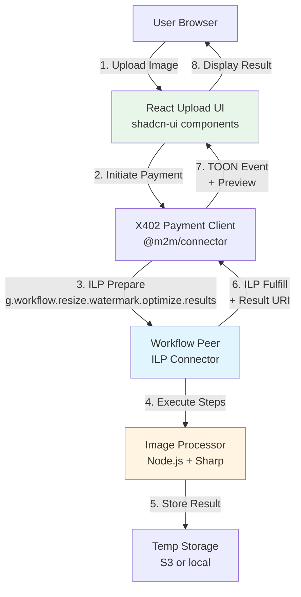
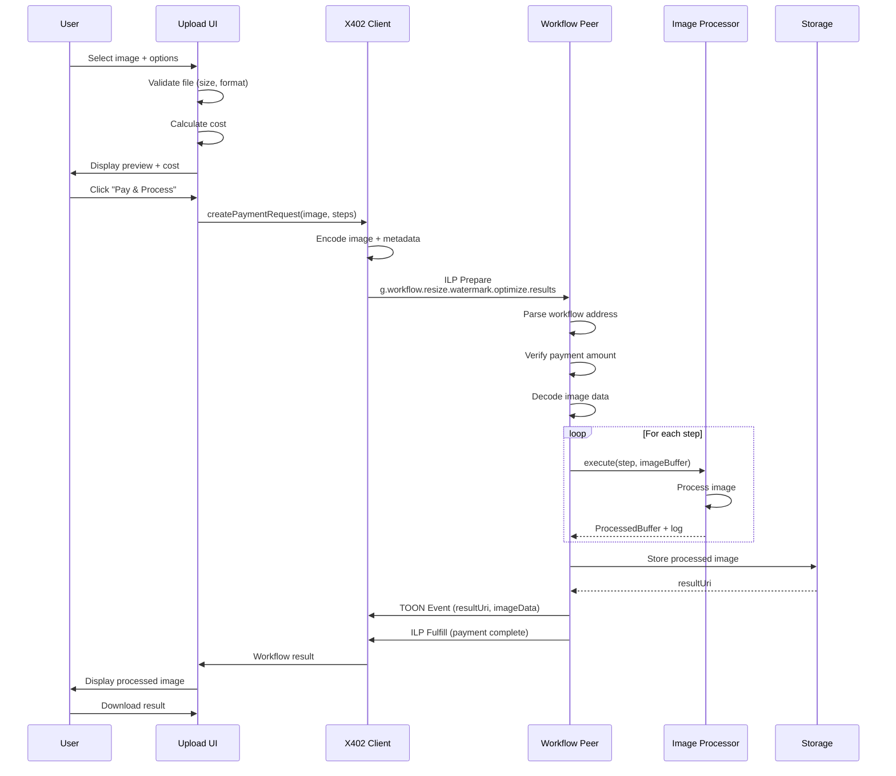
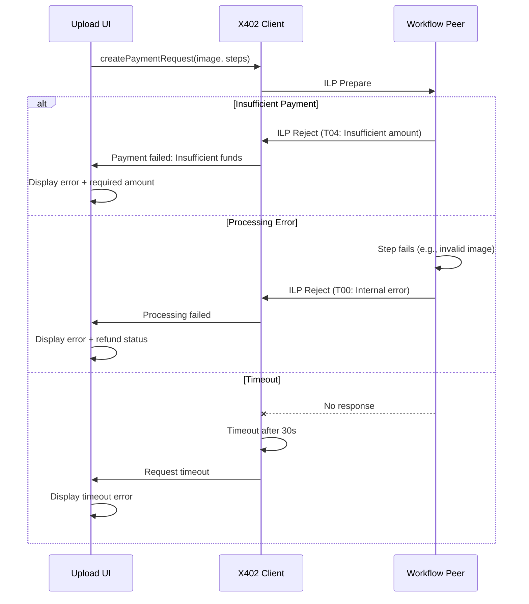

# Workflow ILP Image Processing Demo Architecture

**Version:** 1.0
**Date:** 2026-02-01
**Author:** Winston (Architect Agent)

---

## Executive Summary

This document defines the architecture for an **Image Processing Workflow Demo** that demonstrates the M2M project's capability to route computational work through Interledger Protocol (ILP) addresses using the Workflow pattern (`g.workflow.*`).

**Key Innovation:** Users upload an image, pay via X402 protocol, and trigger a multi-step processing pipeline (resize → watermark → optimize) that executes on a workflow-capable ILP peer, with the processed result delivered back to the client.

**Demo Value:**

- Visual, compelling demonstration of workflow routing
- Integrates payment (X402) with computation (Workflow ILP)
- Self-contained, easy to run locally
- Shows Agent Society Protocol can handle real work, not just toy examples

---

## High-Level Architecture

### Technical Summary

The demo implements a full-stack application where:

1. **Frontend (React + shadcn-ui):** User-friendly image upload interface
2. **X402 Payment Client:** Initiates payment request and workflow execution via ILP
3. **Workflow Peer:** ILP connector that recognizes `g.workflow.*` addresses and executes pipeline steps
4. **Image Processor:** Node.js service that performs resize, watermark, and optimize operations
5. **Result Delivery:** Processed image returned to client via ILP/TOON event stream

The architecture demonstrates **payments + computation routing** working together in a real-world scenario.

### System Architecture Diagram



### Workflow Address Format

```
g.workflow.resize.watermark.optimize.results

Breaking down:
- g.workflow        → Indicates this is a workflow address
- resize           → Step 1: Resize to target dimensions
- watermark        → Step 2: Add watermark overlay
- optimize         → Step 3: Optimize for web (compression)
- results          → Destination to receive final result
```

---

## Tech Stack

| Category               | Technology             | Version  | Purpose                               | Rationale                                  |
| ---------------------- | ---------------------- | -------- | ------------------------------------- | ------------------------------------------ |
| **Frontend Framework** | React                  | 18.x     | UI implementation                     | Already in M2M stack, component-based      |
| **UI Components**      | shadcn-ui              | v4       | Upload interface, progress indicators | Project standard, excellent UX patterns    |
| **State Management**   | React Context/useState | 18.x     | Local state for upload flow           | Demo doesn't need complex state management |
| **CSS Framework**      | Tailwind CSS           | 4.x      | Styling                               | Required by shadcn-ui                      |
| **Image Processing**   | Sharp                  | 0.33.x   | Resize, watermark, optimize           | Fast, production-ready, pure Node.js       |
| **Payment Protocol**   | X402                   | Custom   | Payment request initiation            | Part of M2M project stack                  |
| **ILP Library**        | @m2m/connector         | 1.0.0    | ILP packet handling                   | M2M project implementation                 |
| **Workflow Routing**   | Custom Middleware      | 1.0.0    | `g.workflow.*` pattern recognition    | Demo-specific implementation               |
| **Event Protocol**     | TOON (ILP Events)      | 1.0.0    | Result delivery to client             | M2M project standard                       |
| **Runtime**            | Node.js                | 20.x LTS | Backend and frontend build            | M2M project standard                       |
| **TypeScript**         | TypeScript             | 5.x      | Type safety across stack              | M2M project standard                       |
| **Storage**            | Local filesystem       | -        | Temporary image storage               | Simplicity for demo (S3 optional)          |
| **Testing**            | Vitest                 | Latest   | Unit and integration tests            | M2M project standard                       |
| **E2E Testing**        | Playwright             | Latest   | UI workflow verification              | Already configured in M2M                  |

---

## Data Models

### ImageUploadRequest

**Purpose:** Represents the initial upload and payment request from client

```typescript
interface ImageUploadRequest {
  imageData: Buffer | Blob; // Raw image data
  fileName: string; // Original filename
  mimeType: string; // image/jpeg, image/png, etc.
  processingSteps: WorkflowStep[]; // Ordered pipeline steps
  paymentDetails: X402PaymentRequest; // Payment information
  clientId: string; // Unique client identifier
  requestId: string; // Unique request ID
}
```

### WorkflowStep

**Purpose:** Defines a single processing step in the pipeline

```typescript
interface WorkflowStep {
  stepName: 'resize' | 'watermark' | 'optimize';
  params: StepParameters;
  costMsat: number; // Cost in millisatoshis
}

type StepParameters = ResizeParams | WatermarkParams | OptimizeParams;

interface ResizeParams {
  width: number;
  height: number;
  fit: 'cover' | 'contain' | 'fill';
}

interface WatermarkParams {
  text: string;
  position: 'bottom-right' | 'bottom-left' | 'center';
  opacity: number; // 0.0 to 1.0
}

interface OptimizeParams {
  quality: number; // 1-100
  format: 'jpeg' | 'png' | 'webp';
}
```

### WorkflowResult

**Purpose:** Contains the processed image and metadata

```typescript
interface WorkflowResult {
  requestId: string; // Matches original request
  resultUri: string; // URI to download processed image
  processedImageData?: Buffer; // Inline data (small images)
  processingTime: number; // Milliseconds
  steps: CompletedStep[]; // Log of executed steps
  totalCost: number; // Total cost in millisatoshis
  metadata: {
    originalSize: number; // Bytes
    processedSize: number; // Bytes
    dimensions: { width: number; height: number };
    format: string;
  };
}

interface CompletedStep {
  stepName: string;
  duration: number; // Milliseconds
  success: boolean;
  error?: string;
}
```

### X402PaymentRequest

**Purpose:** Payment details for the workflow execution

```typescript
interface X402PaymentRequest {
  workflowAddress: string; // g.workflow.resize.watermark.optimize.results
  totalAmount: string; // Amount in ILP base units
  assetCode: string; // Currency code (e.g., 'USD', 'BTC')
  assetScale: number; // Decimal scale
  senderAddress: string; // Client's ILP address
  expiresAt: Date; // Payment expiration
  memo?: string; // Optional description
}
```

---

## Components

### 1. Frontend: Image Upload UI

**Responsibility:** Provide intuitive upload experience with payment integration

**Technology Stack:**

- React 18.x with TypeScript
- shadcn-ui v4 components (Card, Button, Input, Progress, Toast)
- Tailwind CSS for styling
- React hooks for state management

**Key Interfaces:**

```typescript
// Component API
interface ImageUploadProps {
  onUploadComplete: (result: WorkflowResult) => void;
  onError: (error: Error) => void;
  maxFileSize?: number; // Default 10MB
  acceptedFormats?: string[]; // Default ['image/jpeg', 'image/png']
}

// Internal hooks
const useImageUpload = () => {
  const [uploadProgress, setUploadProgress] = useState(0);
  const [paymentStatus, setPaymentStatus] = useState<PaymentStatus>();
  const [workflowStatus, setWorkflowStatus] = useState<WorkflowStatus>();

  return {
    uploadImage,
    initiatePayment,
    subscribeToResults,
  };
};
```

**Dependencies:**

- X402 Payment Client (for payment initiation)
- TOON Event Listener (for result delivery)
- @m2m/connector (ILP communication)

**UI Flow:**

```
1. User selects image → File input with drag-and-drop
2. Preview shown → shadcn-ui Card with image preview
3. Processing options → Checkboxes for resize/watermark/optimize
4. Cost displayed → Real-time calculation based on steps
5. Pay & Process button → Initiates X402 payment
6. Progress indicator → shadcn-ui Progress bar with status
7. Result preview → Display processed image with download option
```

---

### 2. X402 Payment Client

**Responsibility:** Initiate and manage payment for workflow execution

**Technology Stack:**

- TypeScript
- @m2m/connector library
- X402 protocol implementation

**Key Interfaces:**

```typescript
class X402WorkflowClient {
  // Create payment request for workflow
  async createWorkflowPaymentRequest(
    workflowAddress: string,
    amount: string,
    imageData: Buffer,
    metadata: WorkflowMetadata
  ): Promise<PaymentRequest>;

  // Execute payment and workflow
  async executePayment(request: PaymentRequest): Promise<PaymentResponse>;

  // Subscribe to workflow results via TOON
  subscribeToResults(requestId: string, callback: (result: WorkflowResult) => void): UnsubscribeFn;

  // Check payment and workflow status
  async getStatus(requestId: string): Promise<WorkflowStatus>;
}
```

**Payment Flow:**

```typescript
// 1. Create payment request with workflow address
const paymentRequest = await x402Client.createWorkflowPaymentRequest(
  'g.workflow.resize.watermark.optimize.results',
  calculateCost(steps),
  imageBuffer,
  { steps, clientId, requestId }
);

// 2. Attach image data as ILP packet data
paymentRequest.ilpPacket.data = encodeImageWithMetadata(imageBuffer, steps);

// 3. Execute payment (triggers workflow)
const response = await x402Client.executePayment(paymentRequest);

// 4. Subscribe to result events
x402Client.subscribeToResults(requestId, (result) => {
  displayProcessedImage(result);
});
```

**Dependencies:**

- ILP Connector (@m2m/connector)
- TOON Event Parser
- Crypto libraries for packet signing

---

### 3. Workflow Peer (ILP Connector)

**Responsibility:** Route and execute workflow-addressed ILP packets

**Technology Stack:**

- Node.js 20.x with TypeScript
- @m2m/connector (base ILP implementation)
- Custom workflow middleware

**Key Interfaces:**

```typescript
interface WorkflowMiddleware {
  // Pattern matching for workflow addresses
  matchesWorkflowPattern(address: string): boolean;

  // Extract workflow steps from address
  parseWorkflowAddress(address: string): WorkflowPipeline;

  // Execute pipeline and handle payment
  async executeWorkflow(
    packet: ILPPrepare,
    pipeline: WorkflowPipeline
  ): Promise<ILPFulfill | ILPReject>;

  // Cost calculation
  calculateWorkflowCost(pipeline: WorkflowPipeline): number;
}

interface WorkflowPipeline {
  steps: WorkflowStep[];
  destinationAddress: string;          // Where to send results
  sourceAddress: string;               // Return address for errors
}
```

**Workflow Execution Logic:**

```typescript
class WorkflowPeer extends ILPConnector {
  async handlePrepare(prepare: ILPPrepare): Promise<ILPFulfill | ILPReject> {
    const address = prepare.destination;

    // Check if this is a workflow address
    if (!address.startsWith('g.workflow.')) {
      return super.handlePrepare(prepare); // Standard routing
    }

    // Parse workflow pipeline from address
    const pipeline = this.parseWorkflowAddress(address);

    // Extract image data from packet
    const { imageData, metadata } = this.decodePacketData(prepare.data);

    // Verify payment amount covers cost
    const requiredAmount = this.calculateWorkflowCost(pipeline);
    if (BigInt(prepare.amount) < requiredAmount) {
      return this.rejectPacket('Insufficient payment');
    }

    // Execute pipeline steps sequentially
    let processedImage = imageData;
    const stepResults: CompletedStep[] = [];

    for (const step of pipeline.steps) {
      const result = await this.imageProcessor.execute(step, processedImage);
      processedImage = result.data;
      stepResults.push(result.log);
    }

    // Store result and get URI
    const resultUri = await this.storeResult(processedImage, metadata.requestId);

    // Send result to destination via TOON event
    await this.sendResultEvent(pipeline.destinationAddress, {
      requestId: metadata.requestId,
      resultUri,
      processedImageData: processedImage,
      steps: stepResults,
    });

    // Fulfill ILP payment
    return this.fulfillPacket(prepare);
  }

  parseWorkflowAddress(address: string): WorkflowPipeline {
    // g.workflow.resize.watermark.optimize.results
    const parts = address.split('.');
    const workflowSteps = parts.slice(2, -1); // Extract middle steps
    const destination = parts[parts.length - 1];

    return {
      steps: workflowSteps.map((name) => this.stepRegistry.get(name)),
      destinationAddress: destination,
      sourceAddress: '', // Extracted from packet metadata
    };
  }
}
```

**Dependencies:**

- Image Processor component
- Storage service (local or S3)
- TOON Event Publisher

---

### 4. Image Processor

**Responsibility:** Execute individual image processing steps using Sharp library

**Technology Stack:**

- Node.js 20.x with TypeScript
- Sharp 0.33.x (high-performance image processing)
- Custom watermarking logic

**Key Interfaces:**

```typescript
interface ImageProcessor {
  // Execute a single processing step
  async execute(
    step: WorkflowStep,
    inputImage: Buffer
  ): Promise<ProcessingResult>;

  // Get cost for a step
  getCost(stepName: string): number;
}

interface ProcessingResult {
  data: Buffer;                        // Processed image
  log: CompletedStep;                  // Execution metadata
}

class ImageProcessorImpl implements ImageProcessor {
  async execute(step: WorkflowStep, inputImage: Buffer): Promise<ProcessingResult> {
    const startTime = Date.now();
    let result: Buffer;

    try {
      switch (step.stepName) {
        case 'resize':
          result = await this.resize(inputImage, step.params as ResizeParams);
          break;
        case 'watermark':
          result = await this.watermark(inputImage, step.params as WatermarkParams);
          break;
        case 'optimize':
          result = await this.optimize(inputImage, step.params as OptimizeParams);
          break;
        default:
          throw new Error(`Unknown step: ${step.stepName}`);
      }

      return {
        data: result,
        log: {
          stepName: step.stepName,
          duration: Date.now() - startTime,
          success: true
        }
      };
    } catch (error) {
      return {
        data: inputImage,  // Return unmodified on error
        log: {
          stepName: step.stepName,
          duration: Date.now() - startTime,
          success: false,
          error: error.message
        }
      };
    }
  }

  private async resize(image: Buffer, params: ResizeParams): Promise<Buffer> {
    return sharp(image)
      .resize(params.width, params.height, { fit: params.fit })
      .toBuffer();
  }

  private async watermark(image: Buffer, params: WatermarkParams): Promise<Buffer> {
    // Create SVG watermark text
    const watermarkSvg = `
      <svg width="200" height="50">
        <text x="10" y="30"
              font-family="Arial"
              font-size="24"
              fill="white"
              opacity="${params.opacity}">
          ${params.text}
        </text>
      </svg>
    `;

    const watermarkBuffer = Buffer.from(watermarkSvg);
    const metadata = await sharp(image).metadata();

    // Position watermark based on params
    const position = this.calculatePosition(
      metadata.width!,
      metadata.height!,
      params.position
    );

    return sharp(image)
      .composite([{
        input: watermarkBuffer,
        ...position
      }])
      .toBuffer();
  }

  private async optimize(image: Buffer, params: OptimizeParams): Promise<Buffer> {
    const processor = sharp(image);

    switch (params.format) {
      case 'jpeg':
        return processor.jpeg({ quality: params.quality }).toBuffer();
      case 'png':
        return processor.png({ quality: params.quality }).toBuffer();
      case 'webp':
        return processor.webp({ quality: params.quality }).toBuffer();
    }
  }

  getCost(stepName: string): number {
    // Cost in millisatoshis
    const costs = {
      resize: 100,
      watermark: 200,
      optimize: 150
    };
    return costs[stepName] || 0;
  }
}
```

**Dependencies:**

- Sharp library
- Node.js Buffer API

---

## Core Workflows

### Workflow 1: Complete Upload and Processing Flow



### Workflow 2: Error Handling Flow



---

## Frontend Architecture Details

### Component Structure

```
packages/connector/explorer-ui/src/
├── components/
│   ├── ImageUpload/
│   │   ├── ImageUpload.tsx          # Main upload component
│   │   ├── ImagePreview.tsx         # Before/after preview
│   │   ├── ProcessingOptions.tsx    # Step selection UI
│   │   ├── PaymentSummary.tsx       # Cost breakdown
│   │   ├── ProgressIndicator.tsx    # Processing status
│   │   └── ResultDisplay.tsx        # Final result viewer
│   ├── ui/ (shadcn-ui components)
│   │   ├── button.tsx
│   │   ├── card.tsx
│   │   ├── input.tsx
│   │   ├── progress.tsx
│   │   ├── toast.tsx
│   │   └── checkbox.tsx
│   └── ...
├── hooks/
│   ├── useImageUpload.ts            # Upload + payment logic
│   ├── useWorkflowStatus.ts         # Status polling
│   └── useTOONSubscription.ts       # Result event listener
├── lib/
│   ├── x402-client.ts               # X402 payment wrapper
│   ├── ilp-utils.ts                 # ILP helper functions
│   └── image-utils.ts               # Client-side image validation
└── pages/
    └── workflow-demo.tsx            # Demo page route
```

### State Management

```typescript
// Upload state machine
type UploadState =
  | { status: 'idle' }
  | { status: 'validating'; file: File }
  | { status: 'ready'; file: File; preview: string; cost: number }
  | { status: 'paying'; paymentRequest: PaymentRequest }
  | { status: 'processing'; progress: number }
  | { status: 'complete'; result: WorkflowResult }
  | { status: 'error'; error: Error };

// Context provider for upload flow
const ImageUploadContext = createContext<{
  state: UploadState;
  actions: {
    selectFile: (file: File) => void;
    updateOptions: (options: ProcessingOptions) => void;
    initiatePayment: () => Promise<void>;
    reset: () => void;
  };
}>(null!);
```

### shadcn-ui Component Usage

```typescript
// ImageUpload.tsx - Main component
import { Card, CardContent, CardDescription, CardFooter, CardHeader, CardTitle } from "@/components/ui/card";
import { Button } from "@/components/ui/button";
import { Input } from "@/components/ui/input";
import { Progress } from "@/components/ui/progress";
import { useToast } from "@/components/ui/use-toast";
import { Checkbox } from "@/components/ui/checkbox";

export function ImageUploadDemo() {
  const { toast } = useToast();
  const { state, actions } = useImageUpload();

  const handleFileSelect = (e: React.ChangeEvent<HTMLInputElement>) => {
    const file = e.target.files?.[0];
    if (file) {
      if (file.size > 10 * 1024 * 1024) {
        toast({
          variant: "destructive",
          title: "File too large",
          description: "Maximum file size is 10MB"
        });
        return;
      }
      actions.selectFile(file);
    }
  };

  return (
    <Card className="w-full max-w-2xl">
      <CardHeader>
        <CardTitle>ILP Workflow Image Processor</CardTitle>
        <CardDescription>
          Upload an image and pay to process it through a workflow pipeline
        </CardDescription>
      </CardHeader>

      <CardContent className="space-y-4">
        {/* File input */}
        <Input
          type="file"
          accept="image/*"
          onChange={handleFileSelect}
          disabled={state.status === 'processing'}
        />

        {/* Preview */}
        {state.status !== 'idle' && (
          <ImagePreview src={state.preview} />
        )}

        {/* Processing options */}
        {state.status === 'ready' && (
          <ProcessingOptions
            onChange={actions.updateOptions}
          />
        )}

        {/* Progress */}
        {state.status === 'processing' && (
          <Progress value={state.progress} />
        )}

        {/* Result */}
        {state.status === 'complete' && (
          <ResultDisplay result={state.result} />
        )}
      </CardContent>

      <CardFooter>
        {state.status === 'ready' && (
          <Button
            onClick={actions.initiatePayment}
            className="w-full"
          >
            Pay {state.cost} msat & Process
          </Button>
        )}
      </CardFooter>
    </Card>
  );
}
```

---

## Backend Architecture Details

### Project Structure

```
packages/connector/
├── src/
│   ├── agent/
│   │   └── workflow-peer.ts         # Workflow-aware ILP connector
│   ├── services/
│   │   ├── image-processor.ts       # Image processing service
│   │   ├── workflow-parser.ts       # Address parsing
│   │   └── storage-service.ts       # Result storage
│   ├── middleware/
│   │   └── workflow-middleware.ts   # ILP middleware
│   └── utils/
│       └── cost-calculator.ts       # Pricing logic
├── test/
│   ├── integration/
│   │   └── workflow-e2e.test.ts     # End-to-end tests
│   └── unit/
│       ├── image-processor.test.ts
│       └── workflow-parser.test.ts
└── storage/
    └── results/                     # Temporary result storage
```

### Workflow Peer Implementation

```typescript
// workflow-peer.ts
import { ILPConnector } from '@m2m/connector';
import { ImageProcessor } from '../services/image-processor';
import { WorkflowParser } from '../services/workflow-parser';

export class WorkflowPeer extends ILPConnector {
  private imageProcessor: ImageProcessor;
  private workflowParser: WorkflowParser;

  constructor() {
    super();
    this.imageProcessor = new ImageProcessor();
    this.workflowParser = new WorkflowParser();

    // Advertise workflow capability
    this.advertiseRoute('g.workflow.*');
  }

  async handlePrepare(prepare: ILPPrepare): Promise<ILPFulfill | ILPReject> {
    // Check if workflow address
    if (!this.workflowParser.isWorkflowAddress(prepare.destination)) {
      return super.handlePrepare(prepare);
    }

    try {
      // Parse and execute workflow
      const pipeline = this.workflowParser.parse(prepare.destination);
      const result = await this.executeWorkflow(prepare, pipeline);

      // Return fulfill with result reference
      return this.createFulfill(prepare, result);
    } catch (error) {
      return this.createReject(prepare, error);
    }
  }

  private async executeWorkflow(
    prepare: ILPPrepare,
    pipeline: WorkflowPipeline
  ): Promise<WorkflowResult> {
    // Implementation from component section above
    // ...
  }
}
```

---

## Development Workflow

### Local Setup

```bash
# Prerequisites
node --version  # Should be 20.x
npm --version   # Should be 10.x

# Initial setup
cd packages/connector
npm install

# Build
npm run build

# Start workflow peer
npm run start:workflow-peer

# In another terminal, start explorer UI
cd packages/connector/explorer-ui
npm run dev
```

### Environment Configuration

```bash
# packages/connector/.env
WORKFLOW_PEER_ADDRESS=g.workflow
ILP_ADDRESS=test.alice.workflow-peer
STORAGE_TYPE=local  # or 's3'
STORAGE_PATH=./storage/results
MAX_IMAGE_SIZE=10485760  # 10MB in bytes
PAYMENT_TIMEOUT=30000    # 30 seconds

# Payment channel config
PAYMENT_CHANNEL_AMOUNT=1000000  # 1M millisatoshis
PAYMENT_CHANNEL_PEER=test.bob

# Image processing defaults
DEFAULT_RESIZE_WIDTH=1024
DEFAULT_RESIZE_HEIGHT=768
DEFAULT_WATERMARK_TEXT="Workflow ILP Demo"
DEFAULT_OPTIMIZE_QUALITY=80
```

---

## Deployment Architecture

### Demo Deployment (Local)

For the demo, everything runs locally:

```
┌─────────────────────────────────────────┐
│         Localhost                       │
│                                         │
│  ┌──────────────────────────────────┐  │
│  │  Explorer UI (Port 3000)         │  │
│  │  - React dev server              │  │
│  │  - Hot reload enabled            │  │
│  └──────────────────────────────────┘  │
│                 ↓                       │
│  ┌──────────────────────────────────┐  │
│  │  Workflow Peer (Port 8080)       │  │
│  │  - ILP connector                 │  │
│  │  - Workflow middleware           │  │
│  │  - Image processor               │  │
│  └──────────────────────────────────┘  │
│                 ↓                       │
│  ┌──────────────────────────────────┐  │
│  │  Storage (./storage/results)     │  │
│  │  - Local filesystem              │  │
│  │  - Temporary result storage      │  │
│  └──────────────────────────────────┘  │
└─────────────────────────────────────────┘
```

### Production-Ready Deployment (Optional)

For a production version:

```
┌─────────────────────────────────────────────┐
│         Vercel (Frontend)                   │
│  - Static React build                       │
│  - CDN distribution                         │
│  - Edge functions for API routes           │
└─────────────────┬───────────────────────────┘
                  │ HTTPS
                  ↓
┌─────────────────────────────────────────────┐
│         AWS (Backend)                       │
│  ┌───────────────────────────────────────┐ │
│  │  API Gateway                          │ │
│  │  - ILP packet routing                 │ │
│  │  - WebSocket for TOON events          │ │
│  └──────────────┬────────────────────────┘ │
│                 ↓                           │
│  ┌───────────────────────────────────────┐ │
│  │  Lambda: Workflow Peer                │ │
│  │  - Node.js 20.x runtime               │ │
│  │  - Workflow execution                 │ │
│  └──────────────┬────────────────────────┘ │
│                 ↓                           │
│  ┌───────────────────────────────────────┐ │
│  │  S3                                   │ │
│  │  - Processed image storage            │ │
│  │  - Pre-signed URLs for download       │ │
│  └───────────────────────────────────────┘ │
└─────────────────────────────────────────────┘
```

---

## Security Considerations

### Payment Security

1. **Amount Verification:** Workflow peer MUST verify payment amount ≥ workflow cost
2. **Packet Signing:** All ILP packets signed with peer keypairs
3. **Replay Protection:** Use ILP packet expiresAt and condition/fulfillment
4. **Rate Limiting:** Limit requests per client (prevent DoS)

```typescript
// Payment verification
if (BigInt(prepare.amount) < this.calculateCost(pipeline)) {
  return this.rejectPacket(ILPErrorCode.T04_INSUFFICIENT_DESTINATION_AMOUNT);
}
```

### Image Security

1. **File Type Validation:** Check magic bytes, not just extension
2. **Size Limits:** Enforce 10MB max to prevent resource exhaustion
3. **Content Scanning:** Optional: scan for malware/NSFW before processing
4. **Sandboxed Processing:** Sharp runs in isolated process

```typescript
// File validation
async validateImage(buffer: Buffer): Promise<boolean> {
  // Check magic bytes for JPEG/PNG
  const header = buffer.slice(0, 4);
  const isJPEG = header[0] === 0xFF && header[1] === 0xD8;
  const isPNG = header[0] === 0x89 && header[1] === 0x50;

  if (!isJPEG && !isPNG) {
    throw new Error('Invalid image format');
  }

  // Additional validation with Sharp
  const metadata = await sharp(buffer).metadata();
  if (!metadata.width || !metadata.height) {
    throw new Error('Invalid image data');
  }

  return true;
}
```

### Storage Security

1. **Temporary Storage:** Auto-delete results after 1 hour
2. **Access Control:** Pre-signed URLs with short expiration (5 min)
3. **No PII in Filenames:** Use UUIDs only
4. **Encryption at Rest:** If using S3, enable SSE-S3

```typescript
// Result cleanup
setInterval(() => {
  const oneHourAgo = Date.now() - 3600000;
  const files = fs.readdirSync('./storage/results');

  files.forEach((file) => {
    const stat = fs.statSync(`./storage/results/${file}`);
    if (stat.mtimeMs < oneHourAgo) {
      fs.unlinkSync(`./storage/results/${file}`);
    }
  });
}, 600000); // Run every 10 minutes
```

---

## Performance Optimization

### Image Processing Performance

1. **Sharp Configuration:** Use Sharp's built-in optimization
2. **Progressive Processing:** Stream results for large images
3. **Caching:** Cache common operations (e.g., watermark SVGs)
4. **Concurrent Steps:** Run independent steps in parallel (if safe)

```typescript
// Optimized processing
const sharp = require('sharp');

// Configure Sharp for performance
sharp.cache({ memory: 100 }); // 100MB cache
sharp.concurrency(2); // Max 2 threads

// Use streaming for large images
const transformer = sharp().resize(1024, 768).jpeg({ quality: 80, progressive: true });

inputStream.pipe(transformer).pipe(outputStream);
```

### Frontend Performance

1. **Lazy Loading:** Load components on demand
2. **Image Optimization:** Compress previews before display
3. **Debounce:** Debounce cost calculations during option changes
4. **Progressive Enhancement:** Show placeholder while loading

```typescript
// Debounced cost calculation
const debouncedCalculateCost = useMemo(
  () =>
    debounce((steps: WorkflowStep[]) => {
      const cost = steps.reduce((sum, step) => sum + step.costMsat, 0);
      setCost(cost);
    }, 300),
  []
);
```

---

## Testing Strategy

### Unit Tests

```typescript
// image-processor.test.ts
describe('ImageProcessor', () => {
  const processor = new ImageProcessor();

  it('should resize image to specified dimensions', async () => {
    const input = await fs.readFile('test-fixtures/sample.jpg');
    const result = await processor.execute(
      {
        stepName: 'resize',
        params: { width: 800, height: 600, fit: 'cover' },
        costMsat: 100,
      },
      input
    );

    const metadata = await sharp(result.data).metadata();
    expect(metadata.width).toBe(800);
    expect(metadata.height).toBe(600);
    expect(result.log.success).toBe(true);
  });

  it('should add watermark to image', async () => {
    const input = await fs.readFile('test-fixtures/sample.jpg');
    const result = await processor.execute(
      {
        stepName: 'watermark',
        params: {
          text: 'TEST',
          position: 'bottom-right',
          opacity: 0.7,
        },
        costMsat: 200,
      },
      input
    );

    expect(result.log.success).toBe(true);
    expect(result.data.length).toBeGreaterThan(0);
  });
});
```

### Integration Tests

```typescript
// workflow-e2e.test.ts
describe('Workflow Integration', () => {
  let workflowPeer: WorkflowPeer;
  let client: X402WorkflowClient;

  beforeAll(async () => {
    workflowPeer = new WorkflowPeer();
    await workflowPeer.start();

    client = new X402WorkflowClient({
      peerAddress: 'test.localhost.workflow-peer',
    });
  });

  it('should execute full workflow pipeline', async () => {
    const imageBuffer = await fs.readFile('test-fixtures/sample.jpg');

    // Create payment request
    const request = await client.createWorkflowPaymentRequest(
      'g.workflow.resize.watermark.optimize.results',
      '450', // 100 + 200 + 150 msat
      imageBuffer,
      {
        steps: ['resize', 'watermark', 'optimize'],
        requestId: 'test-123',
      }
    );

    // Execute payment and workflow
    const response = await client.executePayment(request);
    expect(response.status).toBe('fulfilled');

    // Subscribe to results
    const result = await new Promise<WorkflowResult>((resolve) => {
      client.subscribeToResults('test-123', resolve);
    });

    expect(result.steps).toHaveLength(3);
    expect(result.steps.every((s) => s.success)).toBe(true);
    expect(result.resultUri).toMatch(/^https?:\/\//);
  });

  it('should reject payment with insufficient amount', async () => {
    const imageBuffer = await fs.readFile('test-fixtures/sample.jpg');

    const request = await client.createWorkflowPaymentRequest(
      'g.workflow.resize.watermark.optimize.results',
      '100', // Too low (need 450)
      imageBuffer,
      { steps: ['resize', 'watermark', 'optimize'], requestId: 'test-124' }
    );

    await expect(client.executePayment(request)).rejects.toThrow('Insufficient payment');
  });
});
```

### E2E Tests with Playwright

```typescript
// workflow-demo.spec.ts
import { test, expect } from '@playwright/test';

test('complete image upload and processing flow', async ({ page }) => {
  await page.goto('http://localhost:3000/workflow-demo');

  // Upload image
  const fileInput = page.locator('input[type="file"]');
  await fileInput.setInputFiles('test-fixtures/sample.jpg');

  // Wait for preview
  await expect(page.locator('img[alt="Preview"]')).toBeVisible();

  // Select processing options
  await page.locator('text=Resize').check();
  await page.locator('text=Watermark').check();
  await page.locator('text=Optimize').check();

  // Verify cost display
  await expect(page.locator('text=/.*450 msat.*/i')).toBeVisible();

  // Click pay and process
  await page.locator('button:has-text("Pay & Process")').click();

  // Wait for progress
  await expect(page.locator('[role="progressbar"]')).toBeVisible();

  // Wait for result (max 30s)
  await expect(page.locator('img[alt="Processed"]')).toBeVisible({ timeout: 30000 });

  // Verify download link
  await expect(page.locator('a:has-text("Download")')).toBeVisible();
});
```

---

## Monitoring and Observability

### Metrics to Track

1. **Payment Metrics:**
   - Payment success rate
   - Average payment amount
   - Payment failures by error code
   - Time to fulfill

2. **Workflow Metrics:**
   - Workflow execution time (per step and total)
   - Workflow success rate
   - Average image size processed
   - Cost per workflow

3. **System Metrics:**
   - CPU usage during processing
   - Memory usage
   - Storage usage
   - Request rate

```typescript
// Prometheus metrics example
const { register, Counter, Histogram } = require('prom-client');

const workflowCounter = new Counter({
  name: 'workflow_executions_total',
  help: 'Total number of workflow executions',
  labelNames: ['status', 'steps'],
});

const workflowDuration = new Histogram({
  name: 'workflow_duration_seconds',
  help: 'Workflow execution duration',
  labelNames: ['step'],
  buckets: [0.1, 0.5, 1, 2, 5, 10],
});

// Usage
workflowCounter.inc({ status: 'success', steps: '3' });
workflowDuration.observe({ step: 'resize' }, 0.243);
```

### Logging

```typescript
// Structured logging with correlation IDs
logger.info('Workflow started', {
  requestId: 'req-123',
  workflowAddress: 'g.workflow.resize.watermark.optimize.results',
  imageSize: 2048576,
  steps: 3,
  paymentAmount: '450',
});

logger.info('Step completed', {
  requestId: 'req-123',
  step: 'resize',
  duration: 243,
  success: true,
});

logger.info('Workflow completed', {
  requestId: 'req-123',
  totalDuration: 1247,
  resultSize: 856432,
  resultUri: 'https://...',
});
```

---

## Cost Model

### Pricing Structure

```typescript
// Cost per step (in millisatoshis)
const STEP_COSTS = {
  resize: 100, // ~$0.0001 at $100k/BTC
  watermark: 200, // ~$0.0002
  optimize: 150, // ~$0.00015
};

// Example workflows
const examples = [
  {
    workflow: 'resize only',
    steps: ['resize'],
    cost: 100,
  },
  {
    workflow: 'resize + watermark',
    steps: ['resize', 'watermark'],
    cost: 300,
  },
  {
    workflow: 'full pipeline',
    steps: ['resize', 'watermark', 'optimize'],
    cost: 450,
  },
];
```

### Dynamic Pricing (Future Enhancement)

```typescript
// Cost could vary based on:
- Image size (larger images = higher cost)
- Processing options (higher quality = higher cost)
- Network congestion (surge pricing)
- Bulk discounts (volume pricing)

interface DynamicPricingParams {
  basePrice: number;
  imageSizeMultiplier: number;
  qualityMultiplier: number;
  congestionMultiplier: number;
  volumeDiscount: number;
}

function calculateDynamicPrice(
  step: WorkflowStep,
  imageSize: number,
  params: DynamicPricingParams
): number {
  let price = params.basePrice;

  // Size factor (1MB baseline, scale linearly)
  price *= 1 + ((imageSize - 1048576) / 1048576) * params.imageSizeMultiplier;

  // Quality factor
  if (step.stepName === 'optimize') {
    const quality = (step.params as OptimizeParams).quality;
    price *= 1 + ((quality - 50) / 50) * params.qualityMultiplier;
  }

  // Network congestion (mock)
  price *= params.congestionMultiplier;

  // Volume discount (mock)
  price *= (1 - params.volumeDiscount);

  return Math.floor(price);
}
```

---

## Future Enhancements

### Phase 2: Additional Workflow Steps

```typescript
// More processing options
const EXTENDED_STEPS = {
  crop: { cost: 100 }, // Smart crop
  filter: { cost: 150 }, // Apply filters (sepia, b&w, etc.)
  blur: { cost: 100 }, // Blur/sharpen
  rotate: { cost: 50 }, // Rotate image
  metadata: { cost: 50 }, // Strip/add metadata
  aiEnhance: { cost: 500 }, // AI-powered enhancement
};

// Example advanced workflow
const advancedWorkflow = 'g.workflow.crop.aiEnhance.watermark.optimize.cdn';
```

### Phase 3: Batch Processing

```typescript
// Process multiple images in one workflow
interface BatchWorkflowRequest {
  images: Buffer[];
  sharedSteps: WorkflowStep[]; // Apply to all
  perImageSteps: WorkflowStep[][]; // Unique per image
}

// Workflow address with batch indicator
const batchAddress = 'g.workflow.batch.resize.watermark.optimize.results';
```

### Phase 4: AI Integration

```typescript
// AI-powered steps
const aiSteps = {
  removeBackground: { cost: 1000 },
  objectDetection: { cost: 800 },
  faceDetection: { cost: 600 },
  styleTransfer: { cost: 2000 },
  superResolution: { cost: 1500 },
};

// Example AI workflow
const aiWorkflow = 'g.workflow.removeBackground.superResolution.optimize.cdn';
```

---

## Success Criteria

### Demo Success Metrics

1. **Functional:**
   - ✅ User can upload image through UI
   - ✅ Payment initiated via X402
   - ✅ Workflow executes all steps successfully
   - ✅ Result delivered back to client
   - ✅ Processed image displayable and downloadable

2. **Performance:**
   - ✅ End-to-end latency < 5 seconds for typical image
   - ✅ UI responsive during processing
   - ✅ No crashes or memory leaks

3. **Educational:**
   - ✅ Clearly demonstrates workflow addressing concept
   - ✅ Shows integration of payments + computation
   - ✅ Easy to explain to non-technical audience

4. **Code Quality:**
   - ✅ Well-documented code
   - ✅ Unit tests pass
   - ✅ Integration tests pass
   - ✅ Type-safe (TypeScript)

---

## Implementation Checklist

### Phase 1: Foundation (Day 1)

- [ ] Set up project structure
- [ ] Install dependencies (Sharp, shadcn-ui components)
- [ ] Create data models and TypeScript interfaces
- [ ] Implement ImageProcessor class with basic steps
- [ ] Write unit tests for ImageProcessor

### Phase 2: Workflow Peer (Day 2)

- [ ] Implement WorkflowParser (address parsing logic)
- [ ] Create WorkflowPeer class extending ILPConnector
- [ ] Add workflow middleware
- [ ] Implement cost calculation
- [ ] Write integration tests

### Phase 3: Frontend (Day 3)

- [ ] Create ImageUpload component with shadcn-ui
- [ ] Implement useImageUpload hook
- [ ] Add X402 client integration
- [ ] Create ProcessingOptions component
- [ ] Add ProgressIndicator and ResultDisplay

### Phase 4: Integration (Day 4)

- [ ] Wire up frontend to workflow peer
- [ ] Test full E2E flow
- [ ] Add error handling and validation
- [ ] Implement TOON event subscription for results
- [ ] Write Playwright E2E tests

### Phase 5: Polish (Day 5)

- [ ] Add loading states and animations
- [ ] Implement proper error messages
- [ ] Add result download functionality
- [ ] Create demo documentation
- [ ] Record demo video

---

## Conclusion

This architecture provides a **complete, production-ready design** for demonstrating ILP Workflow addressing with a real-world use case. The image processing demo is:

- **Visual and intuitive** - Non-technical users can understand it
- **Technically compelling** - Shows real integration of payments + computation
- **Extensible** - Easy to add more workflow steps or features
- **Well-architected** - Clean separation of concerns, testable, maintainable

The demo proves that **Agent Society Protocol** can route not just messages and payments, but **actual computational work** through the network.

---

**Next Steps:**

1. Review and approve this architecture
2. Create implementation story/epic in docs/stories/
3. Begin development with Phase 1 checklist
4. Use this document as reference throughout implementation
