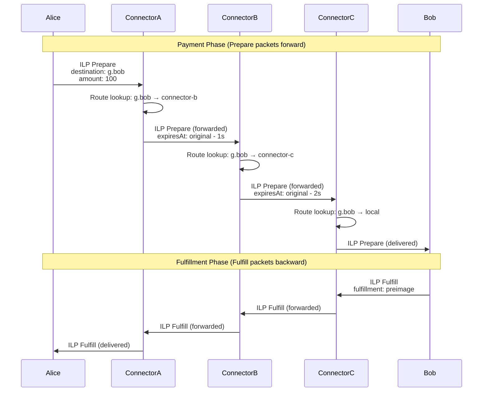
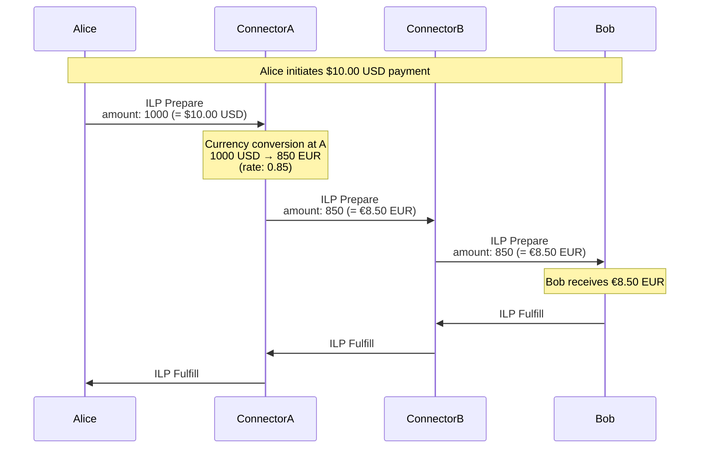

# ILP Routing and Packet Structure Guide

**A comprehensive guide to understanding ILP packet routing, packet structure, and amount handling**

---

## Table of Contents

1. [Overview](#overview)
2. [ILP Packet Structure](#ilp-packet-structure)
3. [ILP Addresses and Routing](#ilp-addresses-and-routing)
4. [Connector Routing Tables](#connector-routing-tables)
5. [Route Discovery Mechanisms](#route-discovery-mechanisms)
6. [Amount Values in ILP](#amount-values-in-ilp)
7. [Complete Routing Examples](#complete-routing-examples)
8. [Cross-Currency Payments](#cross-currency-payments)
9. [References](#references)

---

## Overview

The **Interledger Protocol (ILP)** is a payment routing protocol that enables payments across different networks and currencies. At its core, ILP uses **destination-based routing** similar to how IP routing works on the internet.

### How ILP Routing Works

In ILP, **connectors** (routing nodes) forward payment packets from sender to receiver across multiple hops:

1. **Sender** creates an ILP Prepare packet with a destination address and amount
2. **Connectors** look up the destination in their routing tables to find the next hop
3. Each connector **forwards** the packet to the next connector using longest-prefix matching
4. **Receiver** fulfills the payment by providing the fulfillment preimage
5. The fulfillment travels **backward** through the same path to the sender

This process works across **any type of ledger or currency** because ILP is designed to be asset-agnostic at the protocol level.

### Key Concepts

- **Packets**: Three types - Prepare (payment request), Fulfill (payment success), Reject (payment failure)
- **Routing Tables**: Map destination address prefixes to next-hop peer identifiers
- **Longest-Prefix Matching**: Algorithm for selecting the most specific route
- **Asset-Agnostic Design**: ILP amounts are abstract values; asset types are defined bilaterally
- **Conditional Payments**: Payments are locked with cryptographic conditions (hash locks)

---

## ILP Packet Structure

ILP v4 defines three packet types: **Prepare**, **Fulfill**, and **Reject**. All packets are encoded using **OER (Octet Encoding Rules)** per [RFC-0030](https://interledger.org/developers/rfcs/oer-encoding/).

### Packet Type Values

```typescript
enum PacketType {
  PREPARE = 12, // Initiate payment
  FULFILL = 13, // Complete payment
  REJECT = 14, // Reject payment
}
```

### ILP Prepare Packet

The **Prepare packet** initiates a conditional payment. It contains all information needed for connectors to route the payment and for the receiver to fulfill it.

```typescript
interface ILPPreparePacket {
  type: PacketType.PREPARE; // Always 12
  amount: bigint; // Transfer amount (uint64, asset-agnostic)
  destination: ILPAddress; // Payment destination (hierarchical address)
  executionCondition: Buffer; // 32-byte SHA-256 hash lock
  expiresAt: Date; // Payment expiration timestamp (ISO 8601)
  data: Buffer; // Application-layer protocol data (e.g., STREAM)
}
```

**Field Descriptions:**

- **`amount`**: Unsigned 64-bit integer representing the payment amount. The meaning of this value (currency, scale) is defined by bilateral agreements between peers.
- **`destination`**: Hierarchical ILP address (e.g., `g.alice.wallet.USD`). Formatted per [RFC-0015](https://interledger.org/developers/rfcs/ilp-addresses/).
- **`executionCondition`**: 32-byte hash (SHA-256). Payment can only be completed by providing the preimage to this hash.
- **`expiresAt`**: ISO 8601 timestamp. Payment must be fulfilled or rejected before this time.
- **`data`**: Optional binary payload for higher-layer protocols like STREAM ([RFC-0029](https://interledger.org/developers/rfcs/stream-protocol/)).

### ILP Fulfill Packet

The **Fulfill packet** completes a payment by providing the preimage (fulfillment) that matches the execution condition.

```typescript
interface ILPFulfillPacket {
  type: PacketType.FULFILL; // Always 13
  fulfillment: Buffer; // 32-byte preimage (SHA-256(fulfillment) = executionCondition)
  data: Buffer; // Optional return data
}
```

**Field Descriptions:**

- **`fulfillment`**: 32-byte preimage whose SHA-256 hash **must match** the `executionCondition` from the corresponding Prepare packet.
- **`data`**: Optional application data returned to sender (e.g., STREAM receipts per [RFC-0039](https://interledger.org/developers/rfcs/stream-receipts/)).

### ILP Reject Packet

The **Reject packet** indicates payment failure with an error code and message.

```typescript
interface ILPRejectPacket {
  type: PacketType.REJECT; // Always 14
  code: ILPErrorCode; // Three-character error code (F00-F99, T00-T99, R00-R99)
  triggeredBy: ILPAddress; // Address of connector that generated this error
  message: string; // Human-readable error description
  data: Buffer; // Additional error context
}
```

**Error Code Categories:**

- **F-prefix (Final)**: Permanent failures, should not retry
  - `F00`: Bad Request
  - `F01`: Invalid Packet (malformed packet structure)
  - `F02`: Unreachable (no route to destination)
  - `F03`: Invalid Amount
- **T-prefix (Temporary)**: Retryable failures
  - `T00`: Internal Error
  - `T01`: Peer Unreachable (next-hop peer unavailable)
  - `T02`: Peer Busy
- **R-prefix (Relative)**: Protocol violations or timing issues
  - `R00`: Transfer Timed Out (packet expired)
  - `R01`: Insufficient Source Amount
  - `R02`: Insufficient Timeout (expiry too soon)

See [RFC-0027 Section 3.3](https://interledger.org/developers/rfcs/interledger-protocol/#ilp-error-codes) for complete error code definitions.

---

## ILP Addresses and Routing

### ILP Address Format

ILP addresses are **hierarchical**, dot-separated strings similar to domain names but with different syntax rules.

**Format Rules** (per [RFC-0015](https://interledger.org/developers/rfcs/ilp-addresses/)):

- Dot-separated segments (e.g., `g.alice`, `g.bob.crypto.wallet`)
- Allowed characters: alphanumeric (`a-z`, `A-Z`, `0-9`), hyphen (`-`), underscore (`_`)
- Case-sensitive
- Length: 1-1023 characters total
- No leading/trailing dots
- No consecutive dots (empty segments)

**Example Addresses:**

```
g.alice                    ✅ Valid
g.bob.crypto.wallet.USD    ✅ Valid
g.connector-hub.eu         ✅ Valid
.g.alice                   ❌ Invalid (leading dot)
g..alice                   ❌ Invalid (consecutive dots)
g.alice!wallet             ❌ Invalid (! not allowed)
```

### Address Hierarchy and Routing

The hierarchical structure enables **prefix-based routing**:

```
g.alice.wallet.USD
│ │     │      │
│ │     │      └─ Asset identifier (USD)
│ │     └──────── Wallet service
│ └────────────── User identifier
└──────────────── Address scheme (g = global)
```

Connectors route based on **longest-prefix matching**. If a routing table has entries for:

- `g` → connector-hub
- `g.alice` → connector-alice
- `g.alice.wallet` → connector-wallet

Then a packet to `g.alice.wallet.USD` would be routed to `connector-wallet` (longest match).

---

## Connector Routing Tables

### Routing Table Structure

Connectors maintain an in-memory routing table that maps ILP address **prefixes** to **next-hop peer identifiers**.

```typescript
interface RoutingTableEntry {
  prefix: string; // ILP address prefix (e.g., "g.alice")
  nextHop: string; // Peer identifier (matches BTP peer ID)
  priority: number; // Tie-breaker for equal-length prefixes (higher wins)
}
```

**Example Routing Table:**

```typescript
const routingTable = [
  { prefix: 'g.alice', nextHop: 'peer-alice', priority: 10 },
  { prefix: 'g.bob', nextHop: 'peer-bob', priority: 5 },
  { prefix: 'g.charlie.wallet', nextHop: 'peer-charlie', priority: 0 },
];
```

### Longest-Prefix Matching Algorithm

When a connector receives a packet for destination `g.alice.wallet.USD`, it performs longest-prefix matching:

1. **Find matching routes**: Check all prefixes that match the destination
   - `g.alice` ✅ matches (destination starts with `g.alice.`)
   - `g.bob` ❌ does not match
   - `g.charlie.wallet` ❌ does not match

2. **Select longest prefix**: Choose the route with the longest matching prefix
   - `g.alice` has length 7 → **selected**

3. **Tie-breaking**: If multiple routes have the same prefix length, use `priority` field (higher wins)

4. **Return next hop**: Return `peer-alice` as the next-hop peer

5. **No match**: If no route matches, generate `F02 Unreachable` error

**Implementation Reference:**

See `packages/connector/src/routing/routing-table.ts` lines 135-157 for the production implementation.

### Routing Table Example from Configuration

Configuration files define static routes. Example from `examples/linear-3-nodes-a.yaml`:

```yaml
routes:
  - prefix: g.connectora # Local delivery (this connector)
    nextHop: connector-a
    priority: 0

  - prefix: g.connectorb # Route to connector B
    nextHop: connector-b
    priority: 0

  - prefix: g.connectorc # Route to connector C (via B)
    nextHop: connector-b # Note: Next hop is B, not C directly
    priority: 0
```

In this linear topology (`A → B → C`), connector A routes packets destined for `g.connectorc` to connector B, which then forwards them to connector C.

---

## Route Discovery Mechanisms

Connectors learn routes through several mechanisms. This implementation primarily uses **static configuration**, with references to other mechanisms defined in RFCs.

### 1. Static Configuration

**Most common approach** for this implementation. Routes are manually configured in YAML files before connector startup.

**Advantages:**

- Simple, predictable routing
- No dynamic protocol complexity
- Suitable for controlled networks and testing

**Example:**

```yaml
# connector-a configuration
routes:
  - prefix: g.connectorb
    nextHop: connector-b
    priority: 0
```

**Use cases:**

- Small-scale deployments (3-10 connectors)
- Testing and development environments
- Educational implementations

**Configuration files:** See `examples/` directory for static route configurations.

### 2. Peering Negotiation

Peers can exchange routing information during **BTP connection establishment**. This is a bilateral exchange, not a full routing protocol.

**How it works:**

1. Two connectors establish a BTP connection
2. Each connector shares its local route prefixes
3. Peers update routing tables with learned prefixes

**Status in this implementation:** Not implemented (Epic 5 scope).

### 3. Connector-to-Connector Protocol (CCP)

**CCP** is a BGP-like routing protocol for Interledger that enables dynamic route propagation across connector networks.

**How it works:**

1. Connectors broadcast route announcements to peers
2. Peers propagate routes through the network
3. Routing tables automatically update based on announcements
4. Supports route attributes (cost, liquidity, latency)

**Status:** Reference implementation exists but not integrated in this project.

**Learn more:** Search Interledger specifications for CCP documentation.

### 4. IL-DCP (Interledger Dynamic Configuration Protocol)

**IL-DCP** ([RFC-0031](https://interledger.org/developers/rfcs/dynamic-configuration-protocol/)) allows clients to discover their ILP address and asset configuration from a parent connector.

**How it works:**

1. Client sends an IL-DCP request packet to its parent connector
2. Connector responds with:
   - Client's assigned ILP address
   - Asset code (e.g., USD, EUR)
   - Asset scale (number of decimal places)

**Example IL-DCP Response:**

```json
{
  "ilpAddress": "g.connector-hub.alice",
  "assetCode": "USD",
  "assetScale": 2
}
```

This tells Alice that:

- Her ILP address is `g.connector-hub.alice`
- Amounts are denominated in USD
- Asset scale is 2 (amounts represent cents, e.g., 100 = $1.00)

**Status in this implementation:** Not implemented (would be Epic 5 scope).

---

## Amount Values in ILP

### Asset-Agnostic Design

ILP packet amounts are **unsigned 64-bit integers** with **no currency information** at the protocol level. This is a fundamental design principle called **asset-agnostic routing**.

```typescript
interface ILPPreparePacket {
  amount: bigint; // Just a number - no currency, no decimals
  // ...
}
```

**Why asset-agnostic?**

1. **Simplicity**: Connectors don't need to understand every currency
2. **Flexibility**: Works with any asset type (fiat, crypto, tokens, points)
3. **Privacy**: Intermediate connectors don't see asset details
4. **Scalability**: Protocol doesn't need updates for new currencies

### Bilateral Agreements

The **meaning of amount values** is defined by **bilateral agreements** between directly connected peers.

**Example Bilateral Agreement:**

```
Peer A ↔ Peer B Agreement:
- Asset Code: USD
- Asset Scale: 2
- Interpretation: amount=100 means $1.00 USD
```

**Key points:**

- Each peer relationship defines its own asset semantics
- Agreements are established out-of-band (configuration, contracts, IL-DCP)
- Different peer relationships can use different assets

### Asset Scale

**Asset scale** defines the number of **decimal places** represented by the integer amount.

```
amount = 12345
assetCode = "USD"
assetScale = 2

Real-world value: 123.45 USD
```

**Common Asset Scales:**

| Asset         | Scale | Example Amount      | Real Value     |
| ------------- | ----- | ------------------- | -------------- |
| USD (dollars) | 2     | 12345               | $123.45        |
| BTC (bitcoin) | 8     | 100000000           | 1.00000000 BTC |
| EUR (euros)   | 2     | 5000                | €50.00         |
| JPY (yen)     | 0     | 1000                | ¥1,000         |
| ETH (ether)   | 18    | 1000000000000000000 | 1.0 ETH        |

**Why use asset scale?**

- Avoids floating-point precision errors
- Represents fractional amounts as integers
- Standardized across financial systems

### Amount Handling Example

**Scenario:** Alice sends 100 units to Bob

```typescript
// Alice creates Prepare packet
const preparePacket: ILPPreparePacket = {
  type: PacketType.PREPARE,
  amount: 100n, // Just the number - no currency info
  destination: 'g.bob.wallet',
  // ... other fields
};

// Connector A → Connector B bilateral agreement:
// - Asset: USD, Scale: 2
// - Interpretation: 100 = $1.00 USD

// Connector B → Bob bilateral agreement:
// - Asset: USD, Scale: 2
// - Bob receives: 100 units = $1.00 USD
```

In this example, all peers use the same asset (USD) and scale (2), so the amount value remains `100` throughout the payment path.

---

## Complete Routing Examples

### Example 1: Linear 3-Hop Payment

**Topology:** Alice → Connector A → Connector B → Connector C → Bob

**Scenario:** Alice sends a payment to Bob through three connectors.



**Routing Tables:**

```yaml
# Connector A
routes:
  - prefix: g.bob
    nextHop: connector-b

# Connector B
routes:
  - prefix: g.bob
    nextHop: connector-c

# Connector C
routes:
  - prefix: g.bob
    nextHop: local  # or connector-c (self)
```

**Key Observations:**

1. Each connector decrements `expiresAt` by a safety margin (1 second) to prevent timeouts
2. Routing decisions use longest-prefix matching at each hop
3. Fulfill packet follows the **exact reverse path** back to sender
4. All connectors forward packets without modifying `amount` (same-currency scenario)

### Example 2: Mesh Topology with Multiple Paths

**Topology:** Full mesh with 4 connectors (A, B, C, D)

**Scenario:** Connector A routes a packet to Connector D. Multiple paths are possible:

- Direct: A → D
- Via B: A → B → D
- Via C: A → C → D

```yaml
# Connector A routing table (mesh topology)
routes:
  - prefix: g.connectorb
    nextHop: connector-b
    priority: 0

  - prefix: g.connectorc
    nextHop: connector-c
    priority: 0

  - prefix: g.connectord
    nextHop: connector-d # Direct route (shortest path)
    priority: 10 # Higher priority than indirect routes
```

**Routing Decision:**

For destination `g.connectord.wallet.alice`:

- Match: `g.connectord` → next hop is `connector-d`
- Result: **Direct route** is selected (1 hop instead of 2)

**Mesh Benefits:**

- Lower latency (fewer hops)
- Redundancy (failover to alternate paths)
- Load balancing potential (if using dynamic routing)

---

## Cross-Currency Payments

ILP's asset-agnostic design enables **cross-currency payments** where different peer relationships use different assets.

### Example: USD to EUR Payment

**Scenario:**

- Alice (USD) sends $10.00 to Bob (EUR)
- Exchange rate: 1 USD = 0.85 EUR
- Expected outcome: Bob receives €8.50

**Topology:** Alice → Connector A → Connector B → Bob

**Bilateral Agreements:**

```yaml
Alice ↔ Connector A:
  assetCode: USD
  assetScale: 2
  # amount=1000 means $10.00

Connector A ↔ Connector B:
  assetCode: EUR
  assetScale: 2
  # amount=850 means €8.50

Connector B ↔ Bob:
  assetCode: EUR
  assetScale: 2
  # amount=850 means €8.50
```

**Payment Flow:**



**Amount Conversions:**

| Hop                 | Amount Value | Real Value Interpretation |
| ------------------- | ------------ | ------------------------- |
| Alice → Connector A | 1000         | $10.00 USD (scale=2)      |
| Connector A → B     | 850          | €8.50 EUR (scale=2)       |
| Connector B → Bob   | 850          | €8.50 EUR (scale=2)       |

**Key Points:**

1. **Amount changes at connector boundaries** when crossing currency zones
2. **Connector A performs currency conversion** (decreases amount due to exchange rate)
3. **ILP protocol itself has no concept of USD/EUR** - amount is just an integer
4. **Bilateral agreements define asset semantics** at each hop
5. **Receiver (Bob) sees final amount in their local currency** (EUR)

### Exchange Rate Handling

Connectors calculate outgoing amounts based on:

- **Incoming amount** (from previous hop)
- **Exchange rate** (USD/EUR rate, updated periodically)
- **Connector fee** (optional spread or fixed fee)

**Example Calculation:**

```typescript
// Connector A receives amount from Alice
const incomingAmount = 1000n; // $10.00 USD (scale=2)

// Exchange rate: 1 USD = 0.85 EUR
const exchangeRate = 0.85;

// Convert to EUR (scale=2)
const outgoingAmount = BigInt(Math.floor(Number(incomingAmount) * exchangeRate)); // 850n = €8.50 EUR

// Forward to Connector B with converted amount
const preparePacket: ILPPreparePacket = {
  amount: outgoingAmount, // 850n
  // ... other fields
};
```

**Connector Considerations:**

- **Slippage**: Exchange rates change; connectors may adjust rates dynamically
- **Fees**: Connectors can take a spread (e.g., use 0.84 instead of 0.85 for profit)
- **Liquidity**: Connectors must have sufficient EUR liquidity to forward payments

### Asset Scale Differences

Cross-currency payments may also involve **different asset scales**.

**Example:** BTC (scale=8) to USD (scale=2)

```yaml
Alice ↔ Connector A:
  assetCode: BTC
  assetScale: 8
  # amount=100000000 means 1.00000000 BTC

Connector A ↔ Bob:
  assetCode: USD
  assetScale: 2
  # amount=6000000 means $60,000.00 USD
```

**Conversion:**

```
Incoming: 100000000 (1.00000000 BTC)
Exchange rate: 1 BTC = $60,000 USD
Outgoing: 6000000 (= $60,000.00 USD)
```

Connectors must handle both **scale differences** and **exchange rates** when converting amounts.

---

## References

### Primary RFCs

- **[RFC-0027: Interledger Protocol v4 (ILPv4)](https://interledger.org/developers/rfcs/interledger-protocol/)**
  Core ILP packet structure, routing, and error codes

- **[RFC-0015: ILP Addresses](https://interledger.org/developers/rfcs/ilp-addresses/)**
  ILP address format, validation rules, and hierarchical structure

- **[RFC-0031: Dynamic Configuration Protocol (IL-DCP)](https://interledger.org/developers/rfcs/dynamic-configuration-protocol/)**
  Protocol for clients to discover ILP address and asset configuration

- **[RFC-0001: Interledger Architecture](https://interledger.org/developers/rfcs/interledger-architecture/)**
  High-level architecture overview and design principles

### Additional RFCs

- **[RFC-0029: STREAM Protocol](https://interledger.org/developers/rfcs/stream-protocol/)**
  Transport layer protocol for streaming payments (uses ILP Prepare `data` field)

- **[RFC-0030: Notes on OER Encoding](https://interledger.org/developers/rfcs/oer-encoding/)**
  Binary encoding format for ILP packets

- **[RFC-0032: Peering, Clearing, and Settlement](https://interledger.org/developers/rfcs/peering-clearing-settling/)**
  Explains bilateral relationships and settlement processes

- **[RFC-0038: Settlement Engines](https://interledger.org/developers/rfcs/settlement-engines/)**
  API for connectors to settle balances with peers

- **[RFC-0039: STREAM Receipts](https://interledger.org/developers/rfcs/stream-receipts/)**
  Proof-of-payment receipts for STREAM protocol

### Implementation References

This guide references the M2M connector implementation:

- **ILP Packet Types:** `packages/shared/src/types/ilp.ts`
- **Routing Table:** `packages/connector/src/routing/routing-table.ts`
- **Packet Handler:** `packages/connector/src/core/packet-handler.ts`
- **Configuration Examples:** `examples/` directory (linear, mesh, hub-spoke topologies)

### External Resources

- **Interledger.org:** [https://interledger.org](https://interledger.org)
  Official Interledger Protocol website

- **Interledger RFCs:** [https://interledger.org/developers/](https://interledger.org/developers/)
  Interledger developer resources including protocol specifications

---

**Document Version:** 1.0
**Last Updated:** 2026-01-01
**Maintained By:** M2M Connector Project
